# Table of content

- [Table of content](#table-of-content)
- [Use mocking in unit test](#use-mocking-in-unit-tests)
	- [When to use weak and when wrap](#when-to-use-weak-mocking-and-when-to-use-wrap-mocking)
	- [Use wrap Mocking](#use-wrap-mocking)
		- [Setup CMake](#setup-cmake)
		- [Setup Test-Case](#setup-test-case)
	- [Use weak Mocking](#use-weak-mocking)
		- [Setup CMake](#setup-cmake-1)
		- [Setup Test-Case](#setup-test-case-1)
	- [conditonal Mocking API](#conditional-mocking-api)
- [creating mock libraries](#create-a-mock-library)
	- [Setup CMake](#setup-cmake-2)
		- [make a weak version of the library](#make-a-weak-version-of-the-library)
		- [create mock library](#create-the-mock-library)
	- [Write mock header file](#write-mock-header-file)
	- [Write mock source](#write-mock-source)
- [Generate weak library](#generate-weak-library)
	- [Self referencing Library](#self-referencing-library)
		- [Scenario A](#scenario-a)
		- [Scenario B](#scenario-b)
		- [Scenario C](#scenario-c)
		- [Scenario D](#scenario-D)
		- [Scenario E](#scenario-E)
		- [Scenario f](#scenario-f)
	- [Extern referencing Library](#extern-referencing-library)

# Use mocking in unit tests

## When to use weak mocking and when to use wrap mocking

To mock an external library, like libc or openssl but also safu for tests in elos wrap mocking is used.
And when a function from the currently tested library needs to be mocked weak mocking is used.

## Use wrap Mocking

### Setup CMake

The relevant package needs to be included with `find_package(<mock_package>)` to be able to use it in this test.
And then the relevant library from that package needs to be included with `<mock_package>::<mock_library>` in the `LIBRARIES` section of the call to `create_unit_test`.

To use the `create_unit_test` cmake function `unit_test.cmake` needs to be included somewhere in the cmake files.

The parameters of `crate_unit_test` are:
- `NAME`:
	The name for the unit test binary
- `SOURCES`:
	The list of sources for this test.
- `INCLUDES`:
	A list of additional include directories
- `LIBRARIES`:
	The libraries to use.
	The order is important for wreak mocking libraries.
- `DEFINITIONS`:
	Additional compile definitions.

#### example
`elos/test/utest/elosd/eventlogging/JsonBackend/elosJsonBackendPersist/CMakeLists.txt`
<pre><code>
<strong>find_package(safu)</strong>

create_unit_test(
  NAME
  test_jsonBackend_elosJsonBackendPersist_utest
  SOURCES
    case_exterr_eventSerialize.c
    case_exterr_writeExactly.c
    case_success.c
    elosJsonBackendPersist_utest.c
  LIBRARIES
    elosd_lib_static_weak
    mock_elos_common_static
    <strong>safu::mock_safu</strong>
)
</code></pre>

First `find_package(safu)` is needed to bring the safu mocks into the tests.
And then the specific library `safu::mock_safu` to include the mocking definitions.

### Setup Test-Case

The mocking header need to be included `#include <[mock_package]/[mock_library].h>`.
And before the mock is used mocking needs to be activated by call to the macro `MOCK_FUNC_AFTER_CALL(<the function to be mocked>, 0)` or something equivalent (detailed description in [conditonal mocking](#conditional-mocking-api)).
Then `expect_value(...)` and all the other cmocka functions can be used normally with the function name `__wrap_<the mocked function>` for the mocked version of the function and `__real_<the mocked function>` for the original.

#### example
```c
#include <safu/mock_safu.h>

[...]

void elosTestElosJsonBackendPersistExterrWriteExactly(void **state) {
	elosTestState_t *testState = *state;

	MOCK_FUNC_AFTER_CALL(safuWriteExactly, 0);
	expect_value(__wrap_safuWriteExactly, fd, 0);
	expect_string(__wrap_safuWriteExactly, buf, testState->expectedString);
	expect_value(__wrap_safuWriteExactly, len, strlen(testState->expectedString));
	will_return(__wrap_safuWriteExactly, -1);

	safuResultE_t reult = testState->backend->persist(testState->backend, &testState->event);

	assert_int_equal(result, SAFU_RESULT_FAILED);
}
```

The safu mocks `safu/mock_safu.h` are included for the header with `__wrap_safuWriteExactly` and `__real_safuWriteExactly`.
And mocking for `safuWriteExactly` is activated with `MOCK_FUNC_AFTER_CALL(safuWriteExactly, 0)` after that all the usual cmocka functions are used with `__wrap_safuWriteExactly`.


## Use weak Mocking

### Setup CMake

The `_static_weak` version of the library needs to be included and the `mock_<library>_static` mock definitions.

#### Example
`elos/test/utest/elosd/eventlogging/JsonBackend/elosJsonBackendPersist/CMakeLists.txt`
<pre><code>
find_package(safu)

create_unit_test(
  NAME
  test_jsonBackend_elosJsonBackendPersist_utest
  SOURCES
    case_exterr_eventSerialize.c
    case_exterr_writeExactly.c
    case_success.c
    elosJsonBackendPersist_utest.c
  LIBRARIES
    <strong>elosd_lib_static_weak</strong>
    <strong>mock_elos_common_static</strong>
    safu::mock_safu
)
</code></pre>

First the `_weak` version of the `elosd_lib_static` library needs to be used so that the mock library `mock_elos_common_static` can override the relevant calls.

### Setup test case

The mocking header for the specific function that should be mocked need to bee included (`#include "mock_[specific header].h"`).
And before the mock is used mocking needs to be activated by a call to the macro `MOCK_FUNC_AFTER_CALL(<the function to be mocked>, 0)` or something equivalent (detailed description in [conditonal mocking](#conditional-mocking-api)).
Then all cmocka functions can be used with the original function name.
If in some instance the original function needs to be called this is possible by calling `__genuine_<the mocked function>`.

#### Example
```c
#include "mock_event.h"

[...]

void elosTestElosJsonBackendPersistExterrEventSerialize(void **state) {
	elosTestState_t *testState = *state;

	MOCK_FUNC_AFTER_CALL(elosEventSerialize, 0);
	expect_value(elosEventSerialize, ptr, &testState->event);
	will_return(elosEventSerialize, NULL);

	safuResultE_t result = testState->backend->persist(testState->backend, &testState->event);

	assert_int_equal(result, SAFU_RESULT_FAILED);
}
```

The elos event mock header (`mock_event.h`) are included for the mock definition of `elosEventSerialize`.
And mocking of `elosEventSerialize` is activated with `MOCK_FUNC_AFTER_CALL(elosEventSerialize, 0)`.
After that the usual cmocka functions are used with `elosEventSerialize`.

## Conditional mocking API

In addition to the test functionalities from [cmocka](https://api.cmocka.org/) in `cmocka_extensions` are some definitions to make creating and running the unit tests a bit easier.

### Setup unit tests

- `TEST_CASE_FUNC_PROTOTYPES(<test case>)`:
	Generates prototypes for the test case function as well as the setup and teardown functions.
	- `void <test case>(void **state)`
	- `int <test_case>Setup(void **state)`
	- `int <test_case>Teardown(void **state)`
- `TEST_CASE(<test case>)`:
	Wrapper to call `cmocka_unit_test_setup_teardown(...)` with the functions initialized by `TEST_CASE_FUNC_PROTOTYPES(...)`.
	Used to add a unit test with setup and teardown to a test suite.
- `TEST_SUITE_FUNC_PROTOTYPES(<test suite name>)`:
	Generates prototypes for setup and teardown functions for the test suite.
- `RUN_TEST_SUITE(<test suite>, <test suite name>)`:
	Takes an Array of test cases, like defined with `TEST_CASE(...)` and runs them with setup and teardown functions like the once defined in `TEST_SUITE_FUNC_PROTOTYPES(...)`.
- `SKIP(fmt, ...)`:
	Skip running this test with a provided skip message for the test log.
- `TEST(method)`:
	Name of the test for the test log.
- `SHOULD(fmt, ...)`:
	Description what the test should do, for the test log.
- `PARAM(fmt, ...)`:
	Parameter description for the test log.
	Useful for tests which are run with a multitude of configurations to see which of them specifically failles.

### Enable mocking for a function call

- `MOCK_FUNC_AFTER_CALL(<mocked function call>, N)`:
	Mock after `N` calls to the original function (no mocking at -1, and alway mocks at -2).
- `MOCK_FUNC_ENABLE(<mocked function call>)`:
	Mock the next calls to the function.
	Is an alias for `MOCK_FUNC_AFTER_CALL(<mocked function call>, 0)`
- `MOCK_FUNC_ALWAYS(<mocked function call>)`:
	Mock all subsequent calls to the function.
	Is an alias for `MOCK_FUNC_AFTER_CALL(<mocked function call>, -2)`
- `MOCK_FUNC_DISABLE(<mocked function call>)`:
	Disable mocking for the function again (needed after `MOCKI_FUNC_ALWAYS()`).
	Is an alias for `MOCK_FUNC_AFTER_CALL(<mocked function call>, -1)`
- `MOCK_FUNC_NEVER(<mocked function call>)`:
	The same as `MOCK_FUNC_DISABLE(<mocked function call>)`

### Mock call

- `will_set_errno(<function>, <value to set errno to>)`:
	For functions which might set `errno` to set a specific value in the mock call.
- `will_return_and_set_errno(<function>, <return value>, <value to set errno to>)`:
	For functions which might set `errno` to set it to a specific value in the mock call and specify a return value.
- `will_return_success(<function>, <return value>)`:
	Sets the return value to 0 and set the value of the return pointer parameter to the `<return value>`.
	For functions that are mocked in a way that first set the return value, and then, only if that indicates success set the return pointer from the parameter to the intended `<return value>`.
- `will_return_error(__mockf)`:
	Alias for `will_return(__mockf, -1)`.
	Sets the return value to -1 and the function most likely then is set to skip setting a return parameter pointer and immediately return.
- `will_set_parameter(METHOD, PARAM_NAME, VALUE)`:
	Alias for the cmocka function `will_return(METHOD, VALUE)` to indicate return value in parameter pointer need to be in correct order.


### Miscellaneous helper functions/macros

- `UNUSED`:
	Alias for `__attribute__((unused))`
- `ARRAY_SIZE(array)`:
	Macro to get the size of an Array
- `void assert_non_null_msg(void *ptr, const char *msg)`
- `void assert_double_equal(const double left, const double right, const double epsilon)`
	assert if two `double` values are within epsilon difference of each other.

# Create a mock library

## Setup CMake

### make a weak version of the library

Include the cmake file `weak_library.cmake` wich defines the function `create_weak_library` that takes a static library and generates a static_weak library.
Needs the script `create_weak_library.sh` to be somewhere reachable.
Looks for it at `${PROJECT_SOURCE_DIR}/test/tools/create_weak_library.sh` per default.

Parameter of `create_weak_library`:
- `FROM`:
	The name of the library to make weak. Needs to be a static library
- `TO`:
	The output name for the week library to be generated. Defaults to `<FROM>_weak`
- `HELPER_SCRIP`:
	The path to `create_weak_library.sh` necessary when the script can't be found in its default location.
- `WEAKEN_DEPENDENCIES`:
	A list of dependencies that will be replaced by there weak version.


### create the mock library

Include the cmake file `create_mock_lib.cmake` wich defines the function `crate_mock_lib` that takes the mocking code, some build options and dependencies and generates a static mock library utilising weak mocking and a shared mock library using wrap mocking.

Parameters of `create_mock_lib`:
- `NAME`:
	The name for the dynamic mock library the static library is `<NAME>_static`
- `SOURCES`:
	The list of source files to compile to the mock library.
- `INCLUDES`:
	A list of include directories to be included `PUBLIC`
- `INCLUDES_DYNAMIC`:
	Not in use
- `INCLUDES_STATIC`:
	Not in use
- `LIBRARIES`:
	A list of libraries to be used with the static weak mock library as well as the dynamic wrap mock library.
- `LIBRARIES_DYNAMIC`:
	A list of libraries only to be used with the dynamic wrap mock library.
- `LIBRARIES_STATIC`:
	A list of libraries only to be used with the static weak mock library.
- `DEFINITIONS`:
	A list of `PRIVATE` compile definitions for both the static weak and the dynamic wrap target.
- `DEFINITIONS_DYNAMIC`:
	A list of `PRIVATE` compile definitions only for the dynamic wrap target.
- `DEFINITIONS_STATIC`:
	A list of `PRIVATE` compile definitions only for both the static weak and the dynamic wrap target.
- `WRAP_FLAG`:
	The compile flag to compile with wrap definitoins.
- `WRAPS`:
	A list of all functins that should be linked with `--wrap`.

Additionally for the dynamic wrap mocking library the variable wich sets the header for the library to use wrap mocking definitions needs to be set.
And for all functions that are mocked a `PUBLIC` compile definition of `-Wl,--wrap=<function name>` needs to be added.

An example of this can be found in `cmocka_examples/test/utest/mocks/extref_dependency/CMakeList.txt`

## Write mock header file

`cmocka_extensions/mock_extensions.h` needs to be included.
And one of `cmocka_extensions/mock_func_wrap.h` or `cmocka_extensions/mock_func_weak.h` need to be included depending on a compile time definition.
```c
#ifdef <VARIABLE TO SET WRAP MOCKING>
#include <cmocka_extensions/mock_func_wrap.h>
#else
#include <cmocka_extensions/mock_func_weak.h>
#endif
```

And then the macro `MOCK_FUNC_PROTOTYPE(<function name>, <return value>, <parameter of function..>)` should be used to generate the header code for mocking that function.

### Example
Found in `cmocka_examples/test/utest/mocks/extref_dependency/mock_extref_dependency.h`
```c
#ifndef _MOCK_EXAMPLE_EXTREF_DEPENDENCY_H
#define _MOCK_EXAMPLE_EXTREF_DEPENDENCY_H

#include <cmocka_extensions/mock_extensions.h>

#ifdef MOCK_EXAMPLE_EXTREF_DEPENDENCY_FUNC_LINKER_WRAPPING
#include <cmocka_extensions/mock_func_wrap.h>
#else
#include <cmocka_extensions/mock_func_weak.h>
#endif

#include "dependency.h"

MOCK_FUNC_PROTOTYPE(dependency, int, int a, int b)

#endif /* _MOCK_EXAMPLE_EXTREF_DEPENDENCY_H */
```


## Write mock source

Use `MOCK_FUNC_BODY(<function name>, <return valeu>, <list of parameters...>)` followed by the body for the mock function.
In the function body the macro `MOCK_IS_ACTIVE(<function name>)` should be used to test if the function is to be mocked or if the original version needs to be called.
To call the original the macro `MOCK_FUNC_REAL(<function name)(<function parameter list...>)` can be used.

Inside the active mock part of the function the cmock way of handling parameters and return values should be used.

### Example
Found in `cmocka_examples/test/utest/mocks/extref_dependency/mock_extref_dependency.c`
```c
#include "mock_extref_dependency.h"

#include <stdlib.h>
#include <stdbool.h>

#include <stdio.h>

MOCK_FUNC_BODY(dependency, int, int a, int b) {
	if (MOCK_IS_ACTIVE(dependency)) {
		printf("   mocked: dependency(%d, %d) {\n", a, b);
		printf("      return %d - %d; // = %d\n", a, b, a - b);
		printf("   }\n");
		return a - b;
	}
	return MOCK_FUNC_REAL(dependency)(a, b);
}
```

Set errno in function call
```C
will_return_and_set_errno(<mocked function name>, <errno value>);
```

# Generate weak library

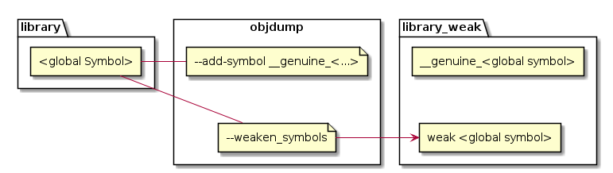

An exact copy of the libraries object file is created with `objcopy`, with just a symbol alias, with the prefix `__genuine`, for all global symbols added.
Then in a second step all the original global symbols are marked as weak, so they will be replaced if in the linking step there is another definition of that symbol, instead of throwing an error.

The symbol table of the original library:

```
000000000000004a T dependency
0000000000000000 T function
                 U printf
                 U puts
```

and the symbol table of the weak version of the library:

```
000000000000004a W dependency
0000000000000000 W function
000000000000004a T __genuine_dependency
0000000000000000 T __genuine_function
                 U printf
                 U puts
```


## Self referencing Library
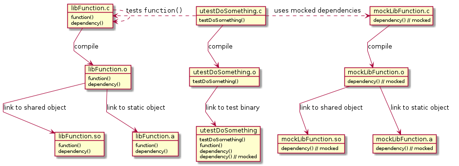

To handle the conflict of `dependencyFunc()` with the mocked version of it `objcopy` is used to turn all symbols in the library into weak symbols so the mocked version can override it.
In the example source this is done with `make selfref_weak.o` for the object file, `make libseflref_static.a` for a static library and `make libseflref_shared.so` for a shared library.


| Scenario         | LibFunction  | mockLibDependency | Resulting Mock Test |
| :------:         | :----------: | :---------------: | :-----------------: |
| [A](#scenario-a) | Static       | Shared            | doesn't work        |
| [B](#scenario-b) | Static       | Object            | Works               |
| [C](#scenario-c) | Static       | Static            | doesn't work        |
| [D](#scenario-d) | Shared       | Shared            | doesn't work        |
| [E](#scenario-e) | Shared       | Object            | Works               |
| [F](#scenario-f) | Shared       | Static            | doesn't work        |


All of the scenarios use the weak version of the library, as to not have a conflict between the original and the mocked dependency.

The working scenarios are [Scenario B](#scenario-b) for a binary statically linked with the library, and [Scenario E](#scenario-e) for a binary linked with a shared library.

### Scenario A
statically links the library and dynamically links the mocked library.

Build with: `make scenario_a`

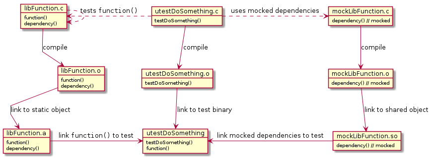

The resulting symbol table of the test binary:
<pre><code>
000000000000037c r __abi_tag
0000000000004020 B __bss_start
0000000000004020 b completed.0
                 w __cxa_finalize@GLIBC_2.2.5
0000000000004010 D __data_start
0000000000004010 W data_start
<strong>00000000000011be W dependency</strong>
0000000000001090 t deregister_tm_clones
0000000000001100 t __do_global_dtors_aux
0000000000003dd8 d __do_global_dtors_aux_fini_array_entry
0000000000004018 D __dso_handle
0000000000003de0 d _DYNAMIC
0000000000004020 D _edata
0000000000004028 B _end
0000000000001228 T _fini
0000000000001140 t frame_dummy
0000000000003dd0 d __frame_dummy_init_array_entry
00000000000021a0 r __FRAME_END__
<strong>0000000000001174 W function</strong>
<strong>00000000000011be T __genuine_dependency</strong>
<strong>0000000000001174 T __genuine_function</strong>
0000000000003fe8 d _GLOBAL_OFFSET_TABLE_
                 w __gmon_start__
000000000000207c r __GNU_EH_FRAME_HDR
0000000000001000 T _init
0000000000002000 R _IO_stdin_used
                 w _ITM_deregisterTMCloneTable
                 w _ITM_registerTMCloneTable
                 U __libc_start_main@GLIBC_2.34
0000000000001149 T main
                 U printf@GLIBC_2.2.5
                 U puts@GLIBC_2.2.5
00000000000010c0 t register_tm_clones
0000000000001060 T _start
0000000000004020 D __TMC_END__
</pre></code>
shows that only the weak functions are part of the binary and not the mocked versions.
This doesn't work, because all needed symbols (`function()` and `dependency()`) are already linked from the static library so the dynamic loader has no reason to search for them.

### Scenario B
Statically links the library and directly links the object file of the mocked library.

Build with: `make scenario_b`

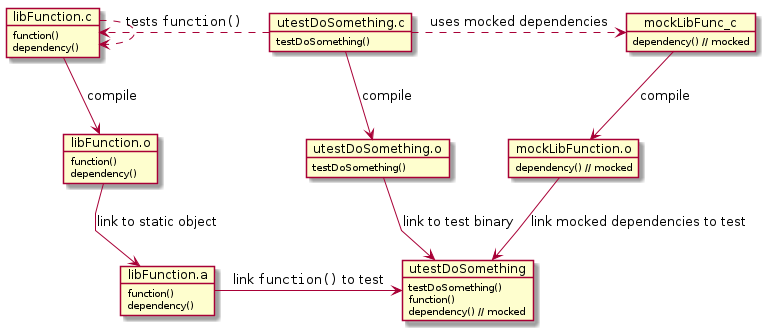

The resulting symbol table of the test binary:
<pre><code>
000000000000037c r __abi_tag
0000000000004020 B __bss_start
0000000000004020 b completed.0
                 w __cxa_finalize@GLIBC_2.2.5
0000000000004010 D __data_start
0000000000004010 W data_start
<strong>0000000000001174 T dependency</strong>
0000000000001090 t deregister_tm_clones
0000000000001100 t __do_global_dtors_aux
0000000000003dd8 d __do_global_dtors_aux_fini_array_entry
0000000000004018 D __dso_handle
0000000000003de0 d _DYNAMIC
0000000000004020 D _edata
0000000000004028 B _end
000000000000128c T _fini
0000000000001140 t frame_dummy
0000000000003dd0 d __frame_dummy_init_array_entry
0000000000002218 r __FRAME_END__
<strong>00000000000011d9 W function</strong>
<strong>0000000000001223 T __genuine_dependency</strong>
<strong>00000000000011d9 T __genuine_function</strong>
0000000000003fe8 d _GLOBAL_OFFSET_TABLE_
                 w __gmon_start__
00000000000020cc r __GNU_EH_FRAME_HDR
0000000000001000 T _init
0000000000002000 R _IO_stdin_used
                 w _ITM_deregisterTMCloneTable
                 w _ITM_registerTMCloneTable
                 U __libc_start_main@GLIBC_2.34
0000000000001149 T main
                 U printf@GLIBC_2.2.5
                 U puts@GLIBC_2.2.5
00000000000010c0 t register_tm_clones
0000000000001060 T _start
</pre></code>
the weak `dependency()` is replaced by the mocked version in this binary. This correctly mocks `dependency()`.

### Scenario C
Statically links both the library and the mocked library.

Build with: `make scenario_c`

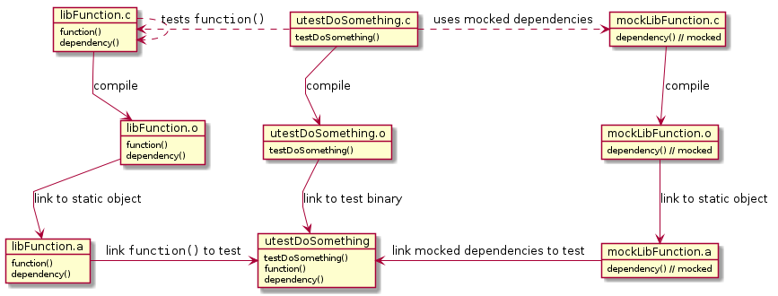

The resulting symbol table of the test binary:
<pre><code>
000000000000037c r __abi_tag
0000000000004020 B __bss_start
0000000000004020 b completed.0
                 w __cxa_finalize@GLIBC_2.2.5
0000000000004010 D __data_start
0000000000004010 W data_start
<strong>00000000000011be W dependency</strong>
0000000000001090 t deregister_tm_clones
0000000000001100 t __do_global_dtors_aux
0000000000003dd8 d __do_global_dtors_aux_fini_array_entry
0000000000004018 D __dso_handle
0000000000003de0 d _DYNAMIC
0000000000004020 D _edata
0000000000004028 B _end
0000000000001228 T _fini
0000000000001140 t frame_dummy
0000000000003dd0 d __frame_dummy_init_array_entry
00000000000021a0 r __FRAME_END__
<strong>0000000000001174 W function</strong>
<strong>00000000000011be T __genuine_dependency</strong>
<strong>0000000000001174 T __genuine_function</strong>
0000000000003fe8 d _GLOBAL_OFFSET_TABLE_
                 w __gmon_start__
000000000000207c r __GNU_EH_FRAME_HDR
0000000000001000 T _init
0000000000002000 R _IO_stdin_used
                 w _ITM_deregisterTMCloneTable
                 w _ITM_registerTMCloneTable
                 U __libc_start_main@GLIBC_2.34
0000000000001149 T main
                 U printf@GLIBC_2.2.5
                 U puts@GLIBC_2.2.5
00000000000010c0 t register_tm_clones
0000000000001060 T _start
0000000000004020 D __TMC_END__
</pre></code>
shows that only the weak functions are included in the binary and not the mocked versions.
This doesn't work, because `dependency()` is not called in `main()` and therefore doesn't need to be linked when linking `mockLibFunction.a` first.
If `libFunction_weak.a`, where `dependency()` is called, is linked first, the definition is also found there and only still *undefined* symbols are looked up and linked.

A workaround that makes this link the original `function()` from `libFunction_weak.a` and the mocked `dependency()` from `mockLibFunction.a` is to call the link step with `-u dependency` so that and then link `mockLibFunction.a` first, so there is an undefined symbol for `dependency()` from the start which get linked from `mockLibFunction.a` before it could come from `libFunction_weak.a`.

### Scenario D
Dynamically links both the library and the mocked library

Build with: `make scenario_d`

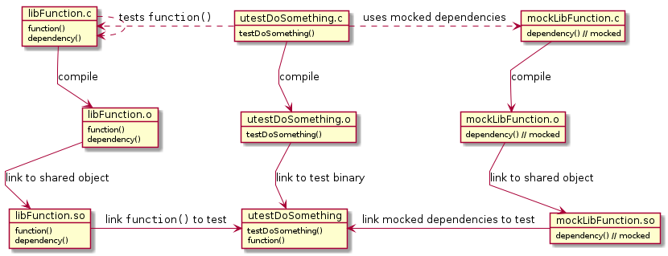

The resulting symbol table of the test binary:
<pre><code>
000000000000037c r __abi_tag
0000000000004020 B __bss_start
0000000000004020 b completed.0
                 w __cxa_finalize@GLIBC_2.2.5
0000000000004010 D __data_start
0000000000004010 W data_start
0000000000001090 t deregister_tm_clones
0000000000001100 t __do_global_dtors_aux
0000000000003dc8 d __do_global_dtors_aux_fini_array_entry
0000000000004018 D __dso_handle
0000000000003dd0 d _DYNAMIC
0000000000004020 D _edata
0000000000004028 B _end
0000000000001174 T _fini
0000000000001140 t frame_dummy
0000000000003dc0 d __frame_dummy_init_array_entry
00000000000020e0 r __FRAME_END__
                 <strong>U function</strong>
0000000000003fe8 d _GLOBAL_OFFSET_TABLE_
                 w __gmon_start__
000000000000200c r __GNU_EH_FRAME_HDR
0000000000001000 T _init
0000000000002000 R _IO_stdin_used
                 w _ITM_deregisterTMCloneTable
                 w _ITM_registerTMCloneTable
                 U __libc_start_main@GLIBC_2.34
0000000000001149 T main
                 U printf@GLIBC_2.2.5
00000000000010c0 t register_tm_clones
0000000000001060 T _start
0000000000004020 D __TMC_END__
</pre></code>
shows that only weak `function()` is present as a symbol and `dependency()` is loaded with the shared library.
Because `dependency()` is not called by the test code the linker doesn't link it so the mocked library is not considered necessary.

This doesn't work, because `dependency()` is not called in `utestDoSomething` which makes it unnecessary to link `mockLibFunction.so`.

A workaround to get `mockLibFunction.so` linked, which makes the dynamic linker choose it's `dependency()` over the weak version, is to link with `--no-as-needet` so everything is linked not just libraries that are strictly needed.

With conditional mocking this might just work out of the box because there `function()`, which is called, is also defined in `mockLibFunction.so`.

### Scenario E
Dynamically links the library and directly links the object file of the mocked library.

Build with: `make scenario_e`
	
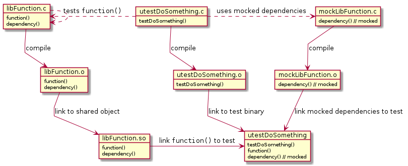

The resulting symbol table of the test binary:
<pre><code>
000000000000037c r __abi_tag
0000000000004028 B __bss_start
0000000000004028 b completed.0
                 w __cxa_finalize@GLIBC_2.2.5
0000000000004018 D __data_start
0000000000004018 W data_start
<strong>0000000000001184 T dependency</strong>
00000000000010a0 t deregister_tm_clones
0000000000001110 t __do_global_dtors_aux
0000000000003dc8 d __do_global_dtors_aux_fini_array_entry
0000000000004020 D __dso_handle
0000000000003dd0 d _DYNAMIC
0000000000004028 D _edata
0000000000004030 B _end
00000000000011ec T _fini
0000000000001150 t frame_dummy
0000000000003dc0 d __frame_dummy_init_array_entry
0000000000002158 r __FRAME_END__
                 <strong>U function</strong>
0000000000003fe8 d _GLOBAL_OFFSET_TABLE_
                 w __gmon_start__
000000000000205c r __GNU_EH_FRAME_HDR
0000000000001000 T _init
0000000000002000 R _IO_stdin_used
                 w _ITM_deregisterTMCloneTable
                 w _ITM_registerTMCloneTable
                 U __libc_start_main@GLIBC_2.34
0000000000001159 T main
                 U printf@GLIBC_2.2.5
                 U puts@GLIBC_2.2.5
00000000000010d0 t register_tm_clones
0000000000001070 T _start
0000000000004028 D __TMC_END__
</pre></code>
the undefined `dependency()` is replaced by the mocked version. This correctly mocks `dependency()`.

### Scenario F
Dynamically links the library and statically links the mocked library.

Build with: `make scenario_f`

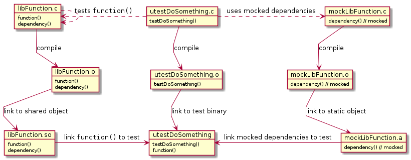

The resulting symbol table of the test binary:
<pre><code>
00000000000037c r __abi_tag
0000000000004020 B __bss_start
0000000000004020 b completed.0
                 w __cxa_finalize@GLIBC_2.2.5
0000000000004010 D __data_start
0000000000004010 W data_start
0000000000001090 t deregister_tm_clones
0000000000001100 t __do_global_dtors_aux
0000000000003dc8 d __do_global_dtors_aux_fini_array_entry
0000000000004018 D __dso_handle
0000000000003dd0 d _DYNAMIC
0000000000004020 D _edata
0000000000004028 B _end
0000000000001174 T _fini
0000000000001140 t frame_dummy
0000000000003dc0 d __frame_dummy_init_array_entry
00000000000020e0 r __FRAME_END__
                 <strong>U function</strong>
0000000000003fe8 d _GLOBAL_OFFSET_TABLE_
                 w __gmon_start__
000000000000200c r __GNU_EH_FRAME_HDR
0000000000001000 T _init
0000000000002000 R _IO_stdin_used
                 w _ITM_deregisterTMCloneTable
                 w _ITM_registerTMCloneTable
                 U __libc_start_main@GLIBC_2.34
0000000000001149 T main
                 U printf@GLIBC_2.2.5
00000000000010c0 t register_tm_clones
0000000000001060 T _start
0000000000004020 D __TMC_END__
</pre></code>
shows that only weak `function()` is present as a symbol and `dependency()` is only needed within the shared library, and therefore not linked from the mocked library.
This doesn't work, because `dependency()` is not called and therefore not linked from `mockLibFunction.a`, only at runtime is seen that it's needed and then the weak version from `libFunction_weak.so` is used.

A workaround to make it link `dependency()` from `mockLibFunction.a` is to force the linker to add the symbol with `-u dependency` then it's linked from `mockLibFunction.a` which overrides the weak version from `libFunction_weak.so`.
In this case wee could even use the original `libFunction.so` because no symbols from a shared library are loaded if there already defined.

## Extern referencing Library
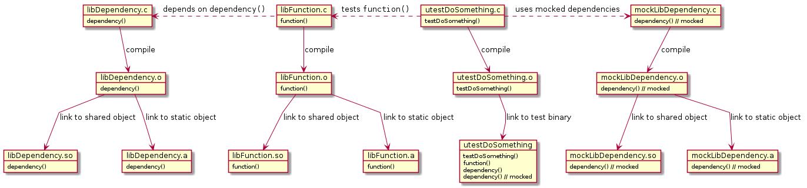

From all possible combinations to link them results this table:

| LibFunction | LibDependency [weak] | mockLibDependency | Resulting Mock Test            |
| :-------:   | :----------------:   | :---------------: | :---:                          |
| Object      | Object               | Object            | Works                          |
| Object      | Static               | Object            | Works                          |
| Object      | Shared               | Object            | Works                          |
| Static      | Object               | Object            | Works                          |
| Static      | Static               | Object            | Works                          |
| Static      | Shared               | Object            | Works                          |
| Shared      | Object               | Object            | Works                          |
| Shared      | Static               | Object            | Works                          |
| Shared      | Shared               | Object            | Works                          |
| Object      | Object               | Static            | Works, with right linker order |
| Object      | Static               | Static            | Works, with right linker order |
| Object      | Shared               | Static            | Works, with right linker order |
| Static      | Object               | Static            | Works, with right linker order |
| Static      | Static               | Static            | Works, with right linker order |
| Static      | Shared               | Static            | Works, with right linker order |
| Shared      | Object               | Static            | Works, with right linker order |
| Shared      | Static               | Static            | Works, with right linker order |
| Shared      | Shared               | Static            | Works, with right linker order |
| Object      | Object               | Shared            | doesn't work                   |
| Object      | Static               | Shared            | Works with right linker order  |
| Object      | Shared               | Shared            | Works, with right linker order |
| Static      | Object               | Shared            | doesn't work                   |
| Static      | Static               | Shared            | Works, with right linker order |
| Static      | Shared               | Shared            | Works, with right linker order |
| Shared      | Object               | Shared            | doesn't work                   |
| Shared      | Static               | Shared            | Works, with right linker order |
| Shared      | Shared               | Shared            | Works, with right linker order |

So it is not possible to link the object file `LibDependency.o` with the shared library `mockLibDependency.so` but every other possibility gives a working mock.
But in all cases where `mockLibDependency` is not linked as an object file but a static or shared library, the link order is relevant, and it only gives a correctly mocked binary if `mockLibDependency` comes before `LibDependency` in the link order.

# Wrap Mocking

With wrap mocking the linker is called with the option `--wrap=<the function that should be mocked>`.
Which replaces all *undefined* references to `<function>` with `__wrap_<function>` and makes all calls to `__real_<function>` resolve to `<function>`.

## Self referencing Library
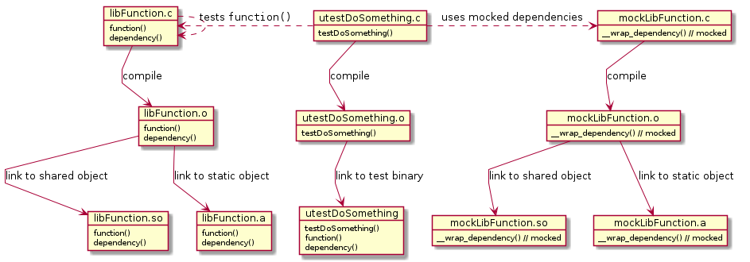

It is not possible to mock the function `dependency()` with the wrap mechanism in a self referencing library.
Because all references are already *defined* before the linker is involved.


## Extern referencing Library
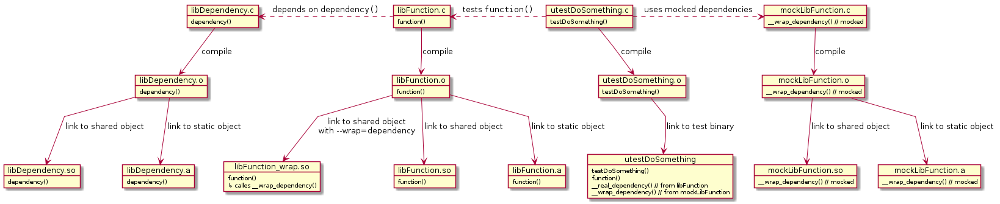

All combinations of static and dynamic linking of `libFunction`, `libDependency` and `mockLibDependency` with the unit test code, except for cases with `libFunction.so`, result in a working mock setup `dependency()`.

When linking with `libFunction.so` running the unit test fails with *symbol lookup error:* `undefined symbol: dependency`.
To make that work `libFunction.o` can be linked to a shared library with `gcc -Wl,--wrap=dependency libFunction.o -o libFunction_wrap.so` where the calls to `dependency()` are already replaced by calls to `__wrap_dependency()`.

| LibFunction   | LibDependency [weak] | mockLibDependency | Resulting Mock Test                   |
| :-------:     | :----------------:   | :---------------: | :---:                                 |
| Object        | Object               | Object            | Works                                 |
| Object        | Static               | Object            | Works                                 |
| Object        | Shared               | Object            | Works                                 |
| Static        | Object               | Object            | Works                                 |
| Static        | Static               | Object            | Works                                 |
| Static        | Shared               | Object            | Works                                 |
| Shared        | Object               | Object            | Error: `undefined symbol: dependency` |
| Shared        | Static               | Object            | Error: `undefined symbol: dependency` |
| Shared        | Shared               | Object            | Error: `undefined symbol: dependency` |
| Shared [Wrap] | Object               | Object            | Works                                 |
| Shared [Wrap] | Static               | Object            | Works                                 |
| Shared [Wrap] | Shared               | Object            | Works                                 |
| Object        | Object               | Static            | Works                                 |
| Object        | Static               | Static            | Works                                 |
| Object        | Shared               | Static            | Works                                 |
| Static        | Object               | Static            | Works                                 |
| Static        | Static               | Static            | Works                                 |
| Static        | Shared               | Static            | Works                                 |
| Shared        | Object               | Static            | Error: `undefined symbol: dependency` |
| Shared        | Static               | Static            | Error: `undefined symbol: dependency` |
| Shared        | Shared               | Static            | Error: `undefined symbol: dependency` |
| Shared [Wrap] | Object               | Static            | Works                                 |
| Shared [Wrap] | Static               | Static            | Works                                 |
| Shared [Wrap] | Shared               | Static            | Works                                 |
| Object        | Object               | Shared            | Works                                 |
| Object        | Static               | Shared            | Works                                 |
| Object        | Shared               | Shared            | Works                                 |
| Static        | Object               | Shared            | Works                                 |
| Static        | Static               | Shared            | Works                                 |
| Static        | Shared               | Shared            | Works                                 |
| Shared        | Object               | Shared            | Error: `undefined symbol: dependency` |
| Shared        | Static               | Shared            | Error: `undefined symbol: dependency` |
| Shared        | Shared               | Shared            | Error: `undefined symbol: dependency` |
| Shared [Wrap] | Object               | Shared            | Works                                 |
| Shared [Wrap] | Static               | Shared            | Works                                 |
| Shared [Wrap] | Shared               | Shared            | Works                                 |

