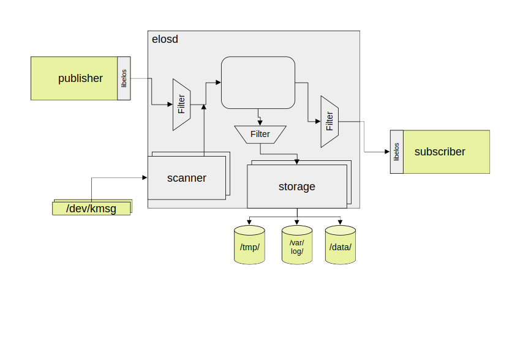

elos - Flexible event logging and management with normalized output-format for linux
------------------------------------------------------------------------------------

Event-driven architectures (EDA [1]_) assume that everything can be
hooked to events and only when the event occurs actions are started.

There are numerous benefits of EDA:

-  Limited computer resources are shared over an enormous number of
   events and handlers that only work if needed and do not waste compute
   resources for polling

-  Already existing architectures of FOSS components assume an EDA

-  Foundation of a micro-service architecture is set-up

In a Linux environment, such architectures find a natural habitat and
many FOSS-components are available to support.

The Linux kernel for example, has many interfaces that can be used to be
notified of important events. The same is true for startup systems and
network attached frameworks such as MQTT.

When looking at these different systems, it becomes clear that each has
its own understanding of events, their arguments and the interface used
to retrieve and send out events.

elos supports design of EDAs by handling events of any kind with
structured and configurable solutions.

.. topic:: Types of generic operating-system-near events:

   -  simple events: startup/shutdown/config-change
   
   -  seldom events: update-processes, reset, factory-reset
   
   -  hardware events: high temperature, error of hardware
   
   -  critical events: hardware failure occurred, failed selftest
   
   -  debug events: out of memory, cpu overload
   
   -  security events: failed log-ins, replacement of credentials
   
   All above events have a very heterogeneous format and way of handling.
   
   elos helps in overcoming this, using a canonical event format.

.. _section-1:

| We begin with an example use case:
| **Requirement:** The client-application shall be started after the
  server-application has finished its initialization.
| Questions to be answered in detailed design:

-  Which event is the right start-signal to start the client?

   -  when port is open?

   -  when process is there?

   -  when a specific log line is written?

   -  when process sends a signal?

All these events are valid to be used as a trigger event for the
client-start.

But they are challenging to implement and maintain

-  What happens if the port changes?

-  What happens if the log isn’t printed any longer?

-  What happens if the handler needs to be extended?

All of the above questions can be answered by writing a script that
checks for *xyz* every 5s and than does *zyx* but that is neither
efficient nor quick, and far from maintainable.

elos approaches this by splitting up and separating event detection,
event structure, event distribution, event filtering, event storage and
handling.

elos – the event and signal funnel
~~~~~~~~~~~~~~~~~~~~~~~~~~~~~~~~~~~~~~~~~~~~~~~~~~~~~~~~~~~~~~~~~~~~~~~

|image0|

design
~~~~~~

elos provides a clean separation in the flow of events:

-  event producer

-  event distribution and filtering

-  event receiving and handling

-  event logging to storage

Events from many different sources are collected by elos or can be
provided to elos for verification. elos takes all of these events and
funnels them to handlers that are interested in that specific event.

elos takes any line printed to syslog or kernel log as a potential event
and is even able to react on ‘silent’ events that only cause a line in a
log to be printed with no further activities.

In the given server client example, the producer side needs to be
modified in case the port number changes. The event itself stays
unmodified and no event receiver will experience any change.

basic architecture of elos
~~~~~~~~~~~~~~~~~~~~~~~~~~

|image1|

elos accepts events from any process using the C API provided by the
libelos library to send events via Inter Process Communication (IPC)
channels. In case libelos cannot be used, the protocol can also be
implemented directly.

The events undergo a first filter-stage to ensure the sender is only
sending events it is allowed to send with a defined and configurable
maximum rate.

| Alternatively, elos can itself “scan” for events in the system. This
  is accomplished by a module loaded to the elos process. Such scanners
  are used to scan the system log and kernel log for events.
| The inner event distribution engine of elos forwards the events to the
  potential subscribers and the logging subsystem.

Depending on the filter configuration, the event is then delivered. The
subscriber receives the event and can further analyze, process and react
to it as needed.

The same filtering technique is used to select the storage of each
event. Depending on the filter-setting, the event is stored in the
respective storage system either permanently or until the next reboot.
The maximum retention time and log size is configurable.

event format
~~~~~~~~~~~~

To handle events efficiently, a unique format is needed. elos defines a
canonical format. The canonical format contains strongly and weakly
typed fields. Strongly typed fields have a strictly defined format
(usually integer) with a fixed elos-wide mapping of numbers and
semantics (e.g. a message code of 4004 always means that something
cannot be found, it is obviousely inspired by HTTP [2]_). Weakly typed
fields can be freely filled by the sender with any kind of information
(usually JSON [3]_ encoded data structures). This mixture allows
flexibility and efficient generic filtering at the same time.

canonical format 
^^^^^^^^^^^^^^^^

.. code-block::

   date : timestamp in nano seconds resolution
   
   source.appName : string
   
   source.fileName : string
   
   source.pid : int
   
   severity : int
   
   hardwareid : string
   
   message code : int (inspired by http)
   
   classification : flags
   
   payload: (text, number, structs)

The *payload* field has no specific type and can be used freely. The
*source* field contains - if applicable - the name and identities of the
emitting entity. If the kernel has sent the event, the pid will be set
to 0.

All other fields are strongly typed and need to be filled out
respectively.

The message code field has a predefined set of code inspired by HTTP
status codes but mapped to a wider range, hence 4004 means that a file
was not found.

Example events
~~~~~~~~~~~~~~

Assuming an embedded in-vehicle environment, where typical Linux events
shall be processed:

Program internal error
^^^^^^^^^^^^^^^^^^^^^^

In the case of a segmentation fault (SIGSEGV) from a process, a mail or
MQTT message is sent to some cloud service. The event might look like
this:

.. code-block::

   date : 123456
   
   source.appName : myApp
   
   source.fileName : /home/user/myApp
   
   source.pid : 1234
   
   severity : 0x2 (=error)
   
   hardwareid : myMachine
   
   message code : 5002
   
   classification : 0x20
   
   payload:
   
   {
   
   "function":"main",
   
   "address": "0x12424f2",
   
   "..."
   
   }

The receiver of the event decodes the payload and might collect further
data from the ECU, the comprehensive data is then sent to e.g. a
cloud-instance.

Use ssh as soon as possible
^^^^^^^^^^^^^^^^^^^^^^^^^^^

It is required to start sshd as soon as a network is attached.

The event might look like this and was derived from networking kernel
interfaces:

.. code-block::

   date : 123456
   
   source.appName : kernel
   
   source.fileName : -
   
   source.pid : 0
   
   severity : 0x04 (=info)
   
   hardwareid : myMachine
   
   message code : 7003
   
   classification : 0x02
   
   payload:
   
   {
   
   "interface": "eth0",
   
   "action": "plugged"
   
   }

Open debugging interfaces if external switch was pressed
^^^^^^^^^^^^^^^^^^^^^^^^^^^^^^^^^^^^^^^^^^^^^^^^^^^^^^^^

Start the debug service as soon as a general purpose input (GPIO) is
switched. The event might look like this:

.. code-block::

   date : 123456
   
   source.appName : kernel
   
   source.fileName : -
   
   source.pid : 0
   
   severity : 0x04 (=info)
   
   hardwareid : myMachine
   
   message code : 7005
   
   classification : 0x80
   
   payload:
   
   {
   
   "interface": "gpio23",
   
   "action": "raise"
   
   }

Report a security incident
^^^^^^^^^^^^^^^^^^^^^^^^^^

Suspicious network pakets did cross the TCP/IP stack and the packet
filter detected them. The resulting logs were converted by a scanner of
elos to an event looking like this:

.. code-block::

   date : 123456
   
   source.appName : kernel
   
   source.fileName : -
   
   source.pid : 0
   
   severity : 0x03 (=warning)
   
   hardwareid : myMachine
   
   message code : 4002
   
   classification : 0x02
   
   payload:
   
   {
   
   “interface”: “eth0”,
   
   “action”: “package dropped”,
   
   {
   
   ... further info on the package
   
   }
   
   }

A possible reaction would be to stop all network activities and shut
down the ECU as a cybersecurity attack might be ongoing. This way elos
can be used to design a cyber security response as required in UN-ECE
R155 5.1.1 (d) [4]_.

But it could also be fine to just store the event in the logs of elos
for later cybersecurity audits. In the latter case no receiver needs to
be implemented. This resulting log is of use for implementation of
UN-ECE R155 5.1.1 (e) “analysis of attempts of cyberattacks”.

event collection – input side
-----------------------------

Input from scanners
~~~~~~~~~~~~~~~~~~~

On the input side elos supports loading of shared objects into the main
process. These modules scan the system for events and feed them into the
internal event queue of elos. Thus, these modules are called scanners.

Depending on the nature of the events, scanners poll for an event
regularly using their own threads or sleep until an event is reported.

Elos handles the syslog and the kernel log with dedicated scanners. They
parse the metadata of each log line for source, severity, etc. The
original line can at any time be retrieved from the payload.

The syslog scanner behaves like an ordinary POSIX syslogger: It receives
all log lines sent using the syslog()function. Each line is converted by
the scanner to an event in canonical format.

The kernel log scanner looks for logs from the kernel by reading
/dev/kmsg. Each log line from the kernel is converted to an event and
processed by elos.

The network scanner makes use of “netlink” [5]_ and “netdevice” [6]_ to
detect events concerning network activities like plugging of
connections, etc. Whenever a change was detected, a generic event in
canonical format is pushed to the elos queue to allow follow-up actions.

Input via API / Socket
~~~~~~~~~~~~~~~~~~~~~~

Additionally to the scanners, external processes can deliver events for
processing and forwarding to elos, either via local IP or
Unix-Domain-Socket.

The library libelos allows easy creation of the needed protocol
structures. Any other environment not using the library needs to
implement the simple and straightforward protocol. This way applications
written in any arbitrary programming language can make use of the
logging and event handling features. It is left to system architects to
make use of this interface for highly specific events of any kind, for
example, in the application software layers.

| **Example:**
| A small C++-based application polls the temperature sensor every 5
  seconds. If it is higher than a certain limit, an event is pushed to
  elos.

That event is filtered and forwarded to all applications doing heavy
calculations. (e.g. doing some Artificial Intelligence) The event causes
these applications to slow down or even to stop their calculations,
which is expected to stop further temperature increases.

|image2|

| **Example:**
| Another application using the SMART [7]_ tools to check the status of
  the flash-based storage reports events via elos.

These events are received and processed by a predictive maintenance
application. This allows a replacement of the storage before it is
running out of spare sectors or it just reduces the write activities
until replacement.

During development or testing of a vehicle, these kinds of events can
help to forecast the degree of wear of the flash and from that the
expected end of life of the storage can be deduced and finally
optimized.

Security aspects
~~~~~~~~~~~~~~~~

The receivers of events from elos usually take actions depending on the
type and content of the event. For example a receiver responsible for a
clean shutdown, will shutdown that ECU in case a battery-low event was
send in. If any process is able to send a fake low-power event via elos,
an unintended shutdown will be initialized.

The countermeasure to this scenario is provided by the elos input
filtering. Only previleged processes are allowed to send in such
critical events. The processes and events are defined the elos config
using rpn-filters.

The processes allowed to send such events are defined by their ELF-file.
In the above example a process running the executable
/usr/bin/system-manager might be allowed to send such events. If the
process has a different executable the event is refused.

The extensions of elos to do the event authorization via powerful
cryptographic algorithms is planned.

Subscribe to ‘your’ events
~~~~~~~~~~~~~~~~~~~~~~~~~~

Via the elos IPC interface any process can register with elos for event
retrieval, e.g. by using the libelos.

After registration, a filter needs to be defined to start receiving
events. Any event that matches the filter is then delivered. It is now
up to the receiving process to further analyze the event or to start an
activity right away.

| **Example:**
| A plugged-event or link up event from the network-subsystem can be
  enough of information to start connecting to a server. The analysis of
  the details and the payload of the event can be omitted, making the
  receiver less complex.

On the other hand, and depending on the nature of the event, the
receiver might need to analyze the event in detail to derive the proper
reaction. Analysis of the payload might become a more complex task as
JSON or similar structures need to be parsed.

Depending on this analysis, the process may react to the event in an
appropriate way, ignore it or even send another event via elos.

The elos filters operate on the canonical format of the events. They are
formulated in reverse polish notation (RPN) [8]_. Any field of the
canonical format including the payload can be used for filtering.
Filters are allowed to use logical operators like ‘and’, ‘or’ or ‘not’,
etc, and combinations of them.

**Example**:

| Filter:
| in RPN: “.event.messageCode 2007 EQ .event.source.appName ‘sshd’ EQ
  AND”
| in infix-notation: “.event.messageCode=2007 && event.source.appName =
  ‘sshd’ ”

This filter maps to the 2007 Code (meaning socket open) from sshd. Hence
the receiver will be informed when the ssh-server is ready to be used.

Hint: The details for detecting this state are left to the input side of
elos, making event detection and handling independent.

| **Example:**
| Filter: “.event.messageCode 5005 EQ”
| The message code 5005 tells us that a process has crashed and
  core-dumped. The resulting action could be to collect forensic data
  and send them to the cloud in order to allow further analysis of the
  issue. Additionally the remaining running software could use this
  event to change into a safe-mode to prevent follow-up issues.

| **Example**
| In this design example some battery handling is assumed. A battery
  monitoring process is regularly checking the conditions of all
  batteries and sends events in case some relevant status has changed.
  The main batteries communicate via the CAN-Bus but backup batteries
  use the Linux default “power_supply” subsystem.

The battery monitoring process sends the following events when
appropriate:

.. code-block::

   date : 123456
   
   source.appName : battery_mon
   
   source.fileName : -
   
   source.pid : 4321
   
   severity : 0x04 (=info)
   
   hardwareid : myMachine
   
   message code : 7007
   
   classification : 0x02
   
   payload:
   
   {
   
   "remaining_time": "1h",
   
   }

Any receiver of this event can now react in an individual way to cope
with the fact that 1h of run time is left. Reactions could be to warn
the driver or to switch off heating.

Another event from the battery monitoring process could be:

.. code-block::

   date : 123456
   
   source.appName : battery_mon
   
   source.fileName : -
   
   source.pid : 4321
   
   severity : 0x03 (=warning)
   
   hardwareid : myMachine
   
   message code : 7008
   
   classification : 0x02
   
   payload:
   
   {
   
   "remaining_time": "30s",
   
   }

With this information, each process should stop energy hungry
calculation immediately. To save power needed for storing data to flash,
a shutdown has to be expected shortly. A more fine-grained design of
events around battery monitoring should be created for an actual real
world application, but that is out of the scope of this paper.

| **Example:** Software updates are installing
| A software update tooling (e.g. over-the-air updates) can make use of
  elos by communicating the start and end of an update process to
  prevent unwanted activities during replacement of software, or to
  inform the user interface about the progress of the update.

| **Example:** The flash (SSD/eMMC) is detecting issues
| Events via elos can be used to implement predictive maintenance. An
  elos-scanner or any other observing process could generate events
  depending on the status of the flash-storage. If the number of
  total-written bytes exceeds a certain amount, or if the count of spare
  blocks goes below a defined limit, an event is sent out. The reaction
  to that event might be to request a hardware replacement and a
  limitation of the writing activities to a minimum. The definitions of
  limits and resulting actions can be freely designed by the architects
  of the ECU Software.

| **Example:** starting applications and containers depending on events
| With integration of an init-system that allows start, stop and control
  of running processes and containers, elos enables a system design that
  starts and stops applications and containers depending on the current
  use-case of the vehicle.
| If a software component detects highway-driving, some containers with
  specific functions for highway driving are started and the container
  for parking-service is shutdown.

**Example:** Get a notification on low free memory (RAM or storage)

The RPN-Filters can even filter with the payload if it is formulated as
JSON. Hence a possible system design could be based on regular
broadcasting of storage status events, e.g. every 5 minutes. These
events carry the actual free space in bytes in the payload. The filters
just forward the event in case the byte-count goes below e.g. 100MB and
that in turn causes a deletion of data increasing the available space
again. Within this design the decision for the trigger limit (here
100MB) was pushed to the receiving side. This shows the amount of
flexibility the system designers have when using elos and its
infrastructures.

event logging and storage backends
----------------------------------

Events passing through elos and influencing all other system parts can
have a high impact on the functionality of the ECU, hence these events
need to be logged and stored for later reference. But elos events that
just occur without software that reacts to them can also play an
important role when it comes to analysis of incidents. To allow this
analysis and further audits elos stores events for later reference.

Logging is a critical activity with an impact on the lifetime of the
flash storage. If all log information is stored, the available capacity
of the flash will not last for a device’s lifetime. The first solution
approach to this would be to delete old logs in a circular buffer
manner. But that might not be the best solution, as the total number of
write cycles of the flash device is still in danger of being exceeded.
This would result in dramatically failing storage devices after longer
periods of use.

To solve this, elos has a filter-based multi-level approach of logging
events in different storage-classes. Each storage-class has a place
“where to store”, a filter “what to store”, and further parameters. The
filters make use of the generic elos filtering approach. If an event
matches to the filter of a storage class the event is logged using the
defined technology to the place defined.

| **Example:**
| Events with a high severity might be logged to a SQL-database residing
  on the eMMC flash. Events stored here are deleted after one year.

Events with a higher severity are logged to a very reliable storage in
NOR-Flash using json to allow easy analysis. These types of events are
never deleted. Power-Fail-safety needs special care on this device.

Events with severity “debug” are logged in a NoSQL-database to a RAM
device to allow debugging. As long as no reboot occurs the data is
available.

Events with very low severity are just discarded.

Depending on the design of the storage technology, event logging with
integrity protection is possible to allow security audits with a high
reliability.

|image3|

Security of the config
~~~~~~~~~~~~~~~~~~~~~~

The configuration details of elos are crucial for its function and hence
for the overall ECU. This leads to the need to secure the configuration
files by checking their integrity and verifying their authenticity. The
easiest way to do this is by storing the configuration immutably in a
dm-verity-secured read-only partition. However that might be impossible
as dynamic (re-)configuration is part of many system architectures.

To address these requirements elos supports fine-grained configuration
parameter verification where critical parameters are verified by
checking signatures. Only if this check is passed the parameter is
accepted, otherwise the default is used.

Non-critical parameters can be set freely in the configuration file.

| **Example:**
| The elos configuration for storage of events is secured with a
  signature of the EBCL integration party. No one is able to modify the
  storage place of events unless authorized. But the internal logging
  level of elos is left open to allow different selections here.

test suite testing elos
-----------------------

Integration tests
~~~~~~~~~~~~~~~~~

elos contains a test suite that verifies correct function when installed
on a Linux-based operating system. The test suite verifies that all
components are installed and behave as defined.

Unit tests
~~~~~~~~~~

elos has a unit test suite that picks each function out of its scope and
tests just the bare features of that particular function. Any function
that is called by the function under test (FUT) can be mocked to enable
stable testing of the function or to inject errors.

Documentation
-------------

elos comes with a full set of internal and external API documentation
along with a user-friendly manual showing the ways to use and configure
elos.

Conclusion
----------

elos is a light-weight event processing framework for event driven
architectures in a Linux environment. It separates the event detection,
filtering, processing, storage, and handling and therefore simplifies
the design of application software and reduces the maintenance
complexity.

elos and its default scanners enable you to hook an event handler to any
line of logging printed to the default logging channels of Linux. This
eases the creation of a first working system design that is based on
elos.

The details for detecting event are left to the input side of elos,
making event filtering and handling independent from the technologies,
interfaces and structures of underlying linux subsystems.

Future extensions
-----------------

Future extensions of elos might cover aspects of static data. elos is a
good candidate to host information that is of system wide interest but
without the character of an event, e.g. an hour-counter that just count
the time the ECU is actively running, or the number of reboots the ECU
has experienced.

Get elos
--------

-  elos is part of Elektrobit’s open-source software solutions called EB
   corbos Linux – built on Ubuntu. see:
   `https://www.elektrobit.com/products/ecu/eb-corbos/Linux/ <https://www.elektrobit.com/products/ecu/eb-corbos/linux/>`__

-  Elektrobit is planning to start an open source community project by
   summer 2023.

-  Contact us for questions: sales@elektrobit.com

.. [1]
   See
   https://medium.com/swlh/the-engineers-guide-to-event-driven-architectures-benefits-and-challenges-3e96ded8568b

.. [2]
   See RFC 7231 „Hypertext Transfer Protocol (HTTP/1.1): Semantics and
   Content“

.. [3]
   See IEC 21778 „The JSON data interchange syntax“

.. [4]
   UN-ECE UN Regulation No. 155; Jan 22nd 2021

.. [5]
   Linux Manpage netlink(7)

.. [6]
   Linux Manpage netdevice(7)

.. [7]
   SMART was originally defined in ATA-Standard ACS-2. The features were
   continued similarly as industry standard in SCSI and even Flash-based
   storage like NVMe based ones.

.. [8]
   Also known as post fix notation. The operator follows the operands.

.. |image0| image:: _static/elos_2D_05.png
   :height: 35em

.. |image2| image:: _static/image3.png
   :width: 6.69306in
   :height: 4.65in

