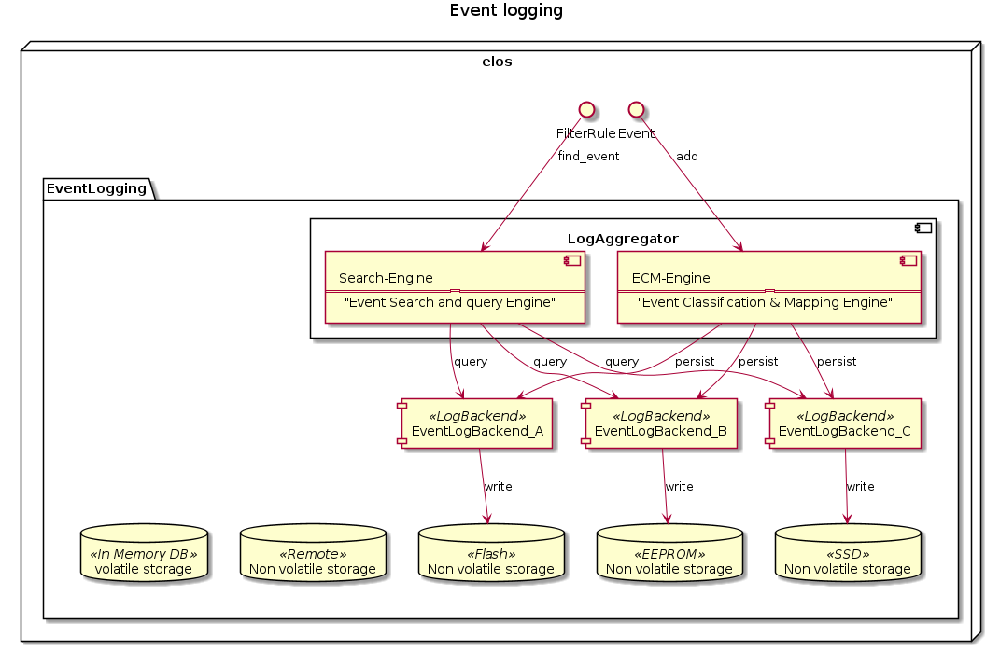

# Architecture Design Record - Event Storage

## Problem

The elos shall archive and store events based on a configurable rule set to
provide later retrieval of events or to browse and search for
specific events matching a certain pattern.

The difference between events provided by the event logging versus the event
processing subsystem, is that the event logging system can be searched without
a subscription and therefore enables a client to retrieve historical events he
never subscribed for.

We can make a categorization of events in
* Historical events
* Real time(\*) events
.

(\* real time in the meaning of the selected subscription and event retrieval strategy of the elos client)

All events published via elos are passed to the event logging subsystem where
the events shall be prepared for later retrieval.
Due to the possible amount of events that can occur and the limits , the following problems come up:

Requirements on the event logging subsystem:

* Healthiness or harmfulness for the hardware (flash wear by log storage)
* Flexible to available space (store all relevant events)
* Reliability that an event is stored
* Reliability that an event is read as stored (protection from modification (Integrity))
* Speed - persisting
* Speed - reading / searching
* reliability of storage (protection from loosing of relevant events (Availability))
* protection of access to events (Confidentiality)

The security targets Confidentiality, Integrity and Availability (CIA) are addressed here.

## Influencing factors

The following constraints have to be taken into account for a suitable solution:

* Live time of Flash storage, less writes of blocks as possible
* Save against power loss – ensure atomic writes of events, do not corrupt event storage due to incomplete writes
* Different sizes of available storage
* Different types of storage

## Assumptions

The following assumptions have been made in the decision process:
* Flash devices or similar (e.g. EEPROM) are used for storage
* Available storage capacity for event storage is somewhere between a few 100 Bytes (e.g. EEPROM) and several GBs.
* The storage time of events ranges from 0 (not stored at all) up to theoretically unlimited (hence >15a)
* Events that are older than their intended storage time shall be actively deleted to save space. (retention policy)

## Considered Alternatives

### 1) Distributed event storage

The basic idea is to not restrict the final used storage technology for events
to a single one. The canonical format of the events contains already suitable
machine readable information to divide events in several storage classes like:

* shall be kept as long as possible – event or payload is unique and probably indispensable
* event should be kept – but it is not critical , can be dropped in favor of more important messages
* event can be kept – not necessary to survive restarts no need to persist
* event is discarded right away - never stored

There are even more categorizations thinkable.

The distributed event storage shall be capable of matching incoming events
against configurable event storage groups and link those groups to specific
storage backends. These backends can be of different types and locations. A
backend shall be defined by the following attributes:

* retention policy
* criticality assurance (atomic writes, read reliability, ...)

(may be not needed as only 'criticality assurance' is the important part)
* storage technology (DBMS, Plain-File, RAW-Device, .... )
* backing device type)

After the definition of [event storage classes](event_storage_class.md) for
historical events and the characterisation of [event storage
backends](event_storage_backends.md) the remaining task for event logging
system is to do the classification of an event against the given storage
classes and then do the mapping to the corresponding storage backend.

To store and load events two different process are necessary.

#### Event Classification and Mapping Engine

Each event must be mapped to a [event storage class](event_storage_class.md),
which is linked to a [event storage backend](event_storage_backends.md). This
shall be done by by a configurable rule set of
[RPN-Filters](../rpnfilter/rpnfilter.md)

#### Search-Engine

The process to load events is a kind of inverted store process. To search for events it must be predicted which storage backends shall be queried.

The implementation of both could use dynamic libraries to allow dynamic configuration and extension.

*pros*
* not bound to a single storage technology, can provide benefits of different storage backends as needed
* easy extensible if new storage technologies become available it can be combined or replaces former ones

*cons*
* overhead due to necessary classification of incoming events
    * But: some kind of filtering is necessary anyway in any solution
* probably a large dependency list, due to unbound possible storage technologies used
    * But: They shall be configurable as dynamic loadable plugins (Dynamic Shared
   Objects) and therefore the system integration design process is responsible
   to make a well balanced selection.

### 2) Direct event log storage

This solution is straight forward by selecting a single storage technology as
storage backend and pass each event through to be persisted on the final
backing storage. Optionally a filter mechanic can be used to reduce the amount
or to decide if an event shall be stored or not.

*pros*
* simplicity, straight forward take the event and store it without further processing
* less dependencies – only one storage technology involved

*cons*
* less flexible and hard if not impossible to find the single storage technology that serves all the requirements (except an implementation of solution one is taken as backend)

## Decision

We choose the distributed event storage approach, number 1.

### Rationale

The distributed approach gives us the opportunity to continuously develop and
evaluate new storage backends and combine them with the current implementation.
If only one back end is configured the solution 1 becomes equal to solution 2
from the behavioral point of view.

### Open Points

