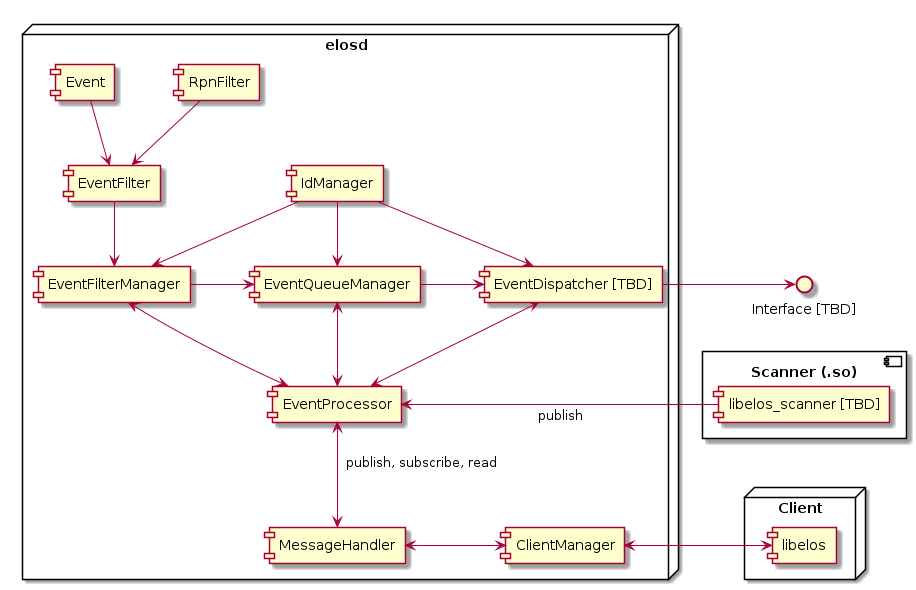

# EventProcessor

## Introduction

The EventProcessor serves as the entry point for published Events and is
responsible for sorting the published Events into their respective EventQueues
based on the previously configured EventFilters. It also provides functions for managing EventQueues and EventFilters and is generally meant as the central
interface when it comes to handling and interacting with Events.

## Component Diagram



## Interface

```c
// Standard interface functions
safuResultE_t
elosEventProcessorInitialize(
        elosEventProcessor_t *eventProcessor,
        elosEventProcessorParam_t const *param);

safuResultE_t
elosEventProcessorDeleteMembers(
        elosEventProcessor_t *eventProcessor);


// EventFilter based functions
safuResultE_t
elosEventProcessorFilterNodeCreateWithQueue(
        elosEventProcessor_t *eventProcessor,
        char const **filterStrings,
        size_t filterStringCount,
        elosEventQueueId_t *eventQueueId,
        elosEventFilterNodeId_t *eventFilterNodeId);

safuResultE_t
elosEventProcessorFilterNodeCreate(
        elosEventProcessor_t *eventProcessor,
        char const **filterStrings,
        size_t filterStringCount,
        elosEventQueueId_t eventQueueId,
        elosEventFilterNodeId_t *eventFilterNodeId);

safuResultE_t
elosEventProcessorFilterNodeRemove(
        elosEventProcessor_t *eventProcessor,
        elosEventFilterNodeId_t eventFilterNodeId);


// EventQueue based functions
safuResultE_t
elosEventProcessorQueueCreate(
        elosEventProcessor_t *eventProcessor,
        elosEventQueueId_t*eventQueueId);

safuResultE_t
elosEventProcessorQueueRemove(
        elosEventProcessor_t *eventProcessor,
        elosEventQueueId_t eventQueueId);

safuResultE_t
elosEventProcessorQueueRead(
        elosEventProcessor_t *eventProcessor,
        elosEventQueueId_t eventQueueId,
        elosEventVector_t **eventVector);


// Generic functions
safuResultE_t
elosEventProcessorPublish(
        elosEventProcessor_t *eventProcessor,
        elosEvent_t const *event);
```

## EventProcessor subcomponents

The EventProcessor is composed of a few submodules that handle different tasks,
these are described here in more detail. They can exist independently of the
EventProcessor, but in the end are meant to work closely together.

### IdManager

The IdManager component generates unique IDs that can be used by other components.
Each IdManager instance will have its own independent set of unique ids.

Note: Not implemented yet

#### IdManager functions

```c
// Standard interface functions
safuResultE_t
elosIdManagerInitialize(elosIdManager_t *im,
                         elosIdManagerParam_t const *param);

safuResultE_t
elosIdManagerDeleteMemebers(elosIdManager_t *im);

// Managing IDs
safuResultE_t
elosIdManagerGenerate(elosIdManager_t *im,
                       elosId_t *id);

safuResultE_t
elosIdManagerDestroy(elosIdManager_t *im,
                      elosId_t id);
```

### EventFilterManager

The EventFilterManager is responsible for comparing incoming Events with
previously created EventFilterNodes as well as appending said Events to EventQueues.

Notes:

- Should `elosEventFilterManagerNodeCreate()` fail, all EventFilters created
  during the function call are automatically removed, as they are currently
  only relevant when associated with a EventFilterNode.
- Functions with "Node" in their name will always refer
  to a specific EventFilterNode, selected by the EventFilterNodeId parameter

#### EventFilterManager functions

```c
// Standard interface functions
safuResultE_t
elosEventFilterManagerInitialize(elosEventFilterManager_t *efm,
                                  elosEventFilterManagerParam_t const *param);

safuResultE_t
elosEventFilterManagerDeleteMembers(elosEventFilterManager_t *efm);

// Create a new EventFilterNode
safuResultE_t
elosEventFilterManagerNodeCreate(elosEventFilterManager_t *efm,
                                  char const **filterStrings,
                                  size_t filterStringCount,
                                  elosEventQueueId_t eqId,
                                  elosEventFilterNodeId_t *efeId);

safuResultE_t
elosEventFilterManagerNodeRemove(elosEventFilterManager_t *efm,
                                  elosEventFilterNodeId_t efeId);

safuResultE_t
elosEventFilterManagerNodeGetEventQueueId(elosEventFilterManager_t *efm,
                                           elosEventFilterNodeId_t efeId,
                                           elosEventQueueId_t *eqId);

// Process one Event, matching it against every previously created EventFilterNode.
// Also adds the Event to the EventFilterNode's EventQueue in case of a match.
safuResultE_t
elosEventFilterManagerProcess(elosEventFilterManager_t *efm,
                               elosEvent_t const *event);
```

### EventQueueManager

The EventQueueManager creates and removes buffers (EventQueues) that store
Events for later retrieval or dispatching.

Notes:

- Functions with "Entry" in their name will always refer
  to a specific EventQueue, selected by the EventQueueId parameter

#### EventQueueManager functions

```c
// Standard interface functions
safuResultE_t
elosEventQueueManagerInitialize(elosEventQueueManager_t *eqm,
                                 elosEventQueueManagerParam_t const *param);

safuResultE_t
elosEventQueueManagerDeleteMembers(elosEventQueueManager_t *eqm);

// Create and remove EventQueues
safuResultE_t
elosEventQueueManagerEntryNew(elosEventQueueManager_t *eqm,
                               elosEventQueueId_t *eqId);

safuResultE_t
elosEventQueueManagerEntryDelete(elosEventQueueManager_t *eqm,
                                  elosEventQueueId_t eqId);

safuResultE_t
elosEventQueueManagerEntrySetLimit(elosEventQueueManager_t *eqm,
                                    elosEventQueueId_t eqId,
                                    elosEventQueueLimitEvents_t limitEvents,
                                    elosEventQueueLimitTime_t limitTime);

safuResultE_t
elosEventQueueManagerEntryGetLimit(elosEventQueueManager_t *eqm,
                                    elosEventQueueId_t eqId,
                                    elosEventQueueLimitEvents_t *limitEvents,
                                    elosEventQueueLimitTime_t *limitTime);

safuResultE_t
elosEventQueueManagerEntryRead(elosEventQueueManager_t *eqm,
                                elosEventQueueId_t eqId,
                                elosEventVector_t **eventVector);

safuResultE_t
elosEventQueueManagerEntryPush(elosEventQueueManager_t *eqm,
                                elosEventQueueId_t eqId,
                                elosEvent_t *event);

safuResultE_t
elosEventQueueManagerEntryPush(elosEventQueueManager_t *eqm,
                                elosEventQueueId_t eqId,
                                elosEvent_t *event);

```

### EventDispatcher

The EventDispatcher will be implemented at a later stage.
It is intended to run in an independent thread that can send Events
automatically to different interfaces, like an UDP socket for example.

Note, TBD: This could also include sending serialized Events,
which would allow very easy processing in a couple of situations
(for example listining with a Python script on the UDP socket).

```c
// Standard interface functions
safuResultE_t
elosEventDispatcherInitialize(elosEventDispatcher_t *ed,
                               elosEventDispatcherParam_t const *param);

safuResultE_t
elosEventDispatcherDeleteMembers(elosEventDispatcher_t *ed);

// TBD
```
