# elos

## Intro

The event logging and management system (elos) is intended to implement and
provide a unified system monitoring interface standard.
The main task is to collect various information about the system and convert
them into a canonical format and therefore annotate the information with a
specific set of meta data if possible. The thus obtained and refined system
information are then :

* persistently stored in a canonical format
* published in a canonical format

The spectrum of system information is wide and ranges from syslog and kmsg to
core dumps to measurements obtained from proc- and sys-fs like for example
temperatures. Those system information are meant to obtained via so called
Scanner which are basically Plugins as shared objects and by any other
application capable to use the provided socket.


## Requirements

For now the requirements are simplified into the following points:

- Scan for different events and store them for later retrieval
- Deliver list of selected events to one or more applications on request
- Ability to push events to elos from an application
- Ability to change events, access rights and other parameters via configuration files
- Ability to easily extend elos with new events later in development
- Ability to easily run in different environments
- Ability to communicate with elos from different languages (e.g. Python)
- Separate event scanner dependencies from elos itself to prevent dependency hell
- Thread safe library functions
- Support multiple user, multi processes
- Be performant and efficient
- ...

## The input and output data formats

The input data processed by elos can divided into two types:
* Non canonical or non normalized Input (Raw Input)
* Canonical or normalized Input (Canonical Input)

The following diagram shows the flow of canonical and non canonical inputs.
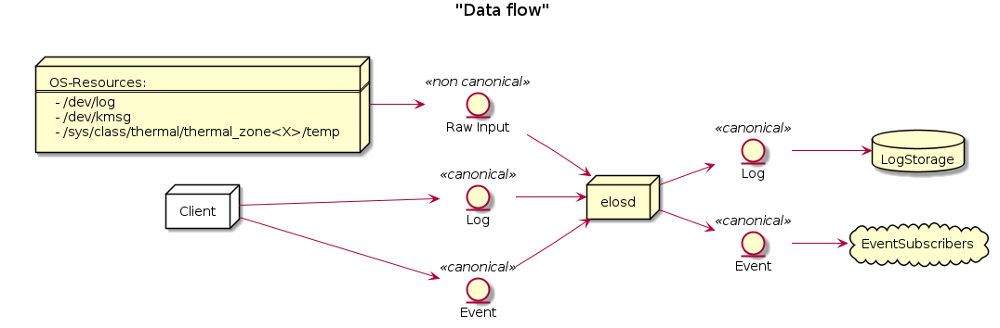

The canonical event entity can then be published and persistently logged which means stored on a non volatile storage for later evaluation.

The event logging and management system daemon has two types of interfaces to obtain input:

* Scanner-API
* Client-API

The Client-API uses a communication protocol where events are encode
in JSON and therefore the canonical format is already enforced.

The Scanner-API also enforce the canonical format of an event from a
scanner implementation for an arbitrary source. The scanner implementation
itself must contain the functionality to convert input data from an arbitrary
source into the canonical format of an event.

### canonical event format

The canonical form for events has the following attributes:

* **date** : unix timestamp in nano seconds resolution
* **source** : a string that identifies the origin of this particular information
* **severity** : when the message gets classified it is mapped to a severity value defined by this project.
* **hardware/hypervisor id** : an unique identifier for the hardware, produced this particular information.
* **message code** : used to hide information (from security perspective), thus an information has a meaning without providing a payload (text)
* **classification** : a set of flags to categorize events.
* **payload**: the actual payload of the information (text, number, structs))

The representation of an event look like:

As internal C-Struct :

```c
struct elosEvent {
  struct timespec date;
  struct elosEventSource_t *source;
  enum elosSeverityE_t severity;
  char* hardwareid;
  u64 classification;
  enum elosEventMessageCodeE_t messageCode;
  char* payload;
}
```

As message payload JSON encoded:
```json
{
  "date": [42,0],
  "source": {
    "appname": "openssh",
    "filename": "/usr/bin/sshd",
    "pid": 208
  },
  "severity": 1,
  "hardwareid": "817d6b97-75f8-4faf-ba3c-583ae1123558",
  "classification": 6,
  "messageCode": 8000,
  "payload": "..."
}
```

The JSON representation can omit empty fields.

### date

* timezone "UTC" is assumed
* time since epoch in UTC is assumed
* resolution nanoseconds
* Format:
  * In `C` is represented by `timespec_t`.
  * The JSON representation of a date field:
```
[int,int] : seconds.nanoseconds
```


### source

* defines the origin of an information, the producer the information
* provide at least one of the following:
  * free form program name
  * PID
  * file name
* => a canonical form for a source description is needed

#### Design decision – source description

It is necessary to define a canonical form for the source meta data point to reflect the different nature of information sources (i.e. files, applications).

##### A) free form string

* simple and no further steps necessary
* logic to read a source descriptor and extract the meaning (parse the string) is necessary every where it is used


##### B) define canonical form

* The source information is translated into a format easy to process
* Reading , using a source descriptor is unified
* The Source descriptor can be defined as follows:
```c
struct elosEventSource_t {
    const char* appName;
    const char* fileName;
    const pid_t pid;
}
```
* A source must have at least one attribute defined
* A source can have more or all attribute defined
* This structure can easily serialized in any binary or textual format. For example in JSON :

```json
{
    "appName": "openssh",
    "fileName": "/usr/bin/sshd",
    "pid": 208
}
```

##### Conclusion

We use B as it is easy machine process able and we can avoid parsing the
information multiple times on different locations.


#### severity

The classification of the severity is done by the corresponding scanner. To have a common understanding of severity levels these are defined by elos as follows:

1. ELOS_SEVERITY_OFF = 0x00  No logging.
2. ELOS_SEVERITY_FATAL = 0x01  Fatal error, not recoverable.
3. ELOS_SEVERITY_ERROR = 0x02  Error with impact to correct functionality.
4. ELOS_SEVERITY_WARN = 0x03  Warning if correct behavior cannot be ensured.
5. ELOS_SEVERITY_INFO = 0x04  Informational, providing high level understanding.
6. ELOS_SEVERITY_DEBUG = 0x05  Detailed information for programmers.
7. ELOS_SEVERITY_VERBOSE = 0x06  Extra-verbose debug messages (highest grade of information)

* Format:

```c
typedef enum elosSeverityE {
    ELOS_SEVERITY_OFF = 0,
    ELOS_SEVERITY_FATAL,
    ELOS_SEVERITY_ERROR,
    ELOS_SEVERITY_WARN,
    ELOS_SEVERITY_INFO,
    ELOS_SEVERITY_DEBUG,
    ELOS_SEVERITY_VERBOSE,
} elosSeverityE_t
```

```json
{
  "severity" : 6,
}
```

The actual mapping or the classification if none provided, for information
coming from an input source to the common severity levels have to be done by
the scanner.


#### hardware- / hypervisor-ID

The hardware- or hypervisor-ID is an identifier to assign an event to a
specific machine. We could use different IDs of the system to create this ID
either by directly using them, queuing them, or using some kind of hash-value,
like generating a SHA-256.

**Suggestion 01: Using IDS from DMI**

```
cat /sys/class/dmi/id/board_serial
cat /sys/class/dmi/id/product_uuid
```
DMI provides different IDs like, for example, the board serial number, which would  
be unique per manufacturer, or the UUID (Universally Unique identifier), which has  
a probability of being duplicated, that is close enough to zero, to be negligible.  

Unfortunately DMI does not seem to be available on our S32G target board (and on  
non-UEFI systems in general, according to the Kernel build config option).  
So this suggestion wont work as our system solution.  


**Suggestion 02: Using the HostID**  

```
#include <unistd.h>
long gethostid(void);
```
From Linux Programmer's Manual (man gethostid):  

      gethostid() respectively get a unique  32-bit identifier for the current machine.  
      The 32-bit identifier is intended to be unique among all UNIX systems in existence.  
      [...]  
      In the glibc implementation, the hostid is stored in the file /etc/hostid.  
      (In glibc versions before 2.2, the file /var/adm/hostid was used.)  
      In the glibc implementation, if gethostid() cannot open the file containing the host  
      ID, then it obtains the hostname using gethostname(2), passes that hostname to  
      gethostbyname_r(3) in order to obtain the host's IPv4 address, and returns a value  
      obtained by bit-twiddling the IPv4 address. (This value may not be unique.)  


**Suggestion 03: Using the ID of the local system, called "machine id"**  

```
cat /etc/machine-id
```
- 32 symbols from 0-9 and a-f  
- The result differs for the local machine and docker  
- Booting the docker twice on the same machine will have the same result  
- Explanation from https://www.man7.org/linux/man-pages/man5/machine-id.5.html:  

      The /etc/machine-id file contains the unique machine ID of the local system that is set  
      during installation or boot. [...]  
      The machine ID does not change based on local or network configuration or when hardware is  
      replaced. [...]  

      This ID uniquely identifies the host. It should be considered "confidential", and must not  
      be exposed in untrusted environments, in particular on the network. If a stable unique  
      identifier that is tied to the machine is needed for some application, the machine ID or  
      any part of it must not be used directly. Instead the machine ID should be hashed with a  
      cryptographic, keyed hash function, using a fixed, application-specific key. That way the  
      ID will be properly unique, and derived in a constant way from the machine ID but there  
      will be no way to retrieve the original machine ID from the application-specific one.  

So if we want to be able to trace it back to this device, we could take it 1:1,  
and if we want to hide the personal data, we can hash it, where the manpage mentioned  
above, offers a solution too in the "relation to osf UUIDS" passage.

**Decision**

Elos will use the machine-id.

- DMI from suggestion 1 isn't available on our system.
- gethostid() from suggestion 2 is only defined for a 32 bit identifier in POSIX.1-2001  
and POSIX.1-2008, so the hostid seems a little bit outdated, like IPv4
- we have already defined how the machine-id can be initialized (init-system, kernel param, ...)  
as described in the initialization part of the manpage  
- passing in the machine-id by kernel argument could be a real serial number, obtained somewhere  
in the early boot stage  
- if this works to distinguish between host and docker system, it should also work for host and  
guest if it becomes necessary  

Note: If we want to use U-Boot to read and pass it along on S32G, we need to investigate how the  
mapping 64-Bit Machine ID to 128-Bit UUID is done right.  

#### classification

The classification attribute is used to categorize events to be related to a certain context of system information. The classification value is a 64 unsigned integer and is splitted into 3 sections.


* bit 1 to 32  (0x00000000FFFFFFFF) reserved by elos (never change their meaning)
* bit 33 to 41 (0x000000FF00000000) can be defined and used by the user (something like User_1-User_7)
* bit 42 to 64 (0xFFFFFF0000000000) reserved for future use


The following table describes the lower 32 bit classification bit mask and their meaning:

|        Value        | Name           | Description                       |
|---------------------|----------------|----------------------------------------------------------------------------------|
|  0x0000000000000000 | undefined      | used to indicate not available classification information                        |
|  0x0000000000000001 | Kernel         | all events which are related to some kernel functionality                        |
|  0x0000000000000002 | Network        | all network related information                                                  |
|  0x0000000000000004 | Security       | all events that are security related                                             |
|  0x0000000000000008 | Power          | all events that is relevant for power management                                 |
|  0x0000000000000010 | Storage        | all events which are related to filesystem and non volatile storage              |
|  0x0000000000000020 | Process        | all events about the livecycle of a process                                      |
|  0x0000000000000040 | IPC            | all events about IPC                                                             |
|  0x0000000000000080 | Hardware       | all events about hardware                                                        |
|  0x0000000000000100 | elos           | all events about elos internals                                                  |
|  0x0000000000000200 | Process Errors | all events about faulty or misbehaving processes                                |

An event can have multiple classification flags, for example a chassis
intrusion detection event can be classified as `Security|Hardware`.

##### Format:

###### Design Decision – format of classification

A) As string list combined with enumerations

* A `NULL` terminated list of strings with enum values as index.
```c
  enum elosClassificationE {
    Network =0,
    Security,
    Audit,
  };
  static const char* elosClassificationNames[] = { "Network", "Security", "Audit", NULL};

  struct elosEvent_t {
     elosClassificationE* classification = {Network, Security, NULL};
  }
  ...printf("%s\n", elosClassificationNames[event.classification[0]]);...
```

```json
{
  "classification" : ["Network","Security","Audit"],
}
```

B) As flags encoded in uint64
```c
  #define NETWORK 1>>0x1ULL
  #define NETWORK 2>>0x1ULL
  #define NETWORK 3>>0x1ULL
  uint64_t classification = NETWORK | SECURITY | AUDIT;
```

```json
{
  "classification" : 7
}
```

###### Decision

Elos uses the approach `B)` and encode the classification in a 64 unsigned integer.

##### messageCode – Meaning and format

The message code is used to annotate an event with a specific meaning to enable
a client to understand the event without parsing the original input or the
payload of the event.

The following table describes the so far defined message code groups

| Range     | Category                         | Description                  | Advised Action                    |
|-----------|----------------------------------|------------------------------|-----------------------------------|
| 0000-0999 | elos events                      | Specific elos events         | can be used as check point or safely ignored|
| 1000-1999 | informational                    | general information of the event source | can safely ignored no action required |
| 2000-2999 | Program / Service Status         | Successful resource acquisition by process, process progress information | can be used to check and verify the state of a process |
| 3000-3999 | Program / Service Resource Error | reports bad input or environment problems| A process is probably not working correctly, due to misconfiguration or unexpected resource behavior |
| 4000-4999 | Program / Service IPC Error      | The process failed to process an external IPC request| if waiting for an IPC response from the event source proceed according to the detailed message code |
| 5000-5999 | Program / Service Execution Error| process terminated by system (mapping to Exit_Codes?)| The event source is killed by the system or will be killed anytime soon, take necessary action immediately and terminate or free all shared resources, do not expect any response from this process|
| 6000-6999 | Hardware fault                   | Unrecoverable hardware fault | the source detected a hardware fault, prepare immediately to get killed without further signals or warning|
| 7000-7999 | Hardware status                  | Hardware state on/off/plugged/unpluged/initialized | the source detected a hardware status change, take action if responsible or interested|
| 8000-8999 | Security Audit                   | Security related events like login attempts or permission changes of resources | If in charge to maintain security, take appropriate action |

###### 0 - 999 elos events

| message code | Description
|--------------|--------------------------------|
| 200          | New subscription |
| 202          | Removed subscription |
| 400          | Failed to create subscription |
| 401          | Failed to remove subscription |
| 501          | Event Blacklist Failed |


###### 1000 - 1999 Informational

| message code | Description
|--------------|--------------------------------|
| 1000         | wildcard - subscribe to any 1xxx|
| 1101         | debug log message |
| 1102         | information log message |
| 1103         | trace log message |
| 1111         | kernel log buffer message |

###### 2000 - 2999 Program Status

| message code | Description
|--------------|--------------------------------|
| 2000         | wildcard - subscribe to any 2xxx|
| 2001         | Process created |
| 2002         | Process exited (exit 0) |
| 2003         | opened file |
| 2004         | closed file |
| 2005         | acquired a lock |
| 2006         | release a lock |
| 2007         | socket opened |
| 2008         | socket closed |

###### 3000 - 3999 Program Resource error

| message code | Description
|--------------|--------------------------------|
| 3000         | wildcard - subscribe to any 3xxx|
| 3001         | Not authorized - authorization for some action failed |
| 3003         | forbidden – action valid but insufficient access rights |
| 3004         | file not found - a path doesn't exist|
| 3005         | read error - reading from a resource failed |
| 3006         | write error - writing to a resource failed |
| 3023         | resource is locked |
| 3422         | message not understood/not parsable |

###### 4000 - 4999 Program IPC error

| message code | Description
|--------------|--------------------------------|
| 4000         | wildcard - subscribe to any 4xxx |
| 4001         | Not authorized - authorization for some action failed |
| 4002         | Malformed IPC request |
| 4005         | method/action not allowed |
| 4006         | can not serve request due to resource error |


###### 5000 - 5999 Program Execution error

| message code | Description
|--------------|--------------------------------|
| 5000         | wildcard - subscribe to any 5xxx |
| 5001         | SIGSYS - illegal syscall |
| 5002         | SIGSEGV/BUS - illegal memory access |
| 5003         | SIGILL - illegal instruction |
| 5004         | SIGFPE - floating point exception |
| 5005         | Core Dumped |
| 5006         | Process Error Code - exit code != 0 (EXIT_SUCCESS) |

###### 6000 - 6999 Hardware Fault

| message code | Description
|--------------|--------------------------------|
| 6000         | wildcard - subscribe to any 6xxx |
| 6001         | device read error|
| 6002         | device write error|
| 6003         | device critical temperature|
| 6004         | device critical power supply|
| 6005         | device setup error|

###### 7000 - 7999 Hardware Status Change

| message code | Description
|--------------|--------------------------------|
| 7000         | wildcard - subscribe to any 7xxx |
| 7001         | (peripheral) device power on |
| 7002         | (peripheral) device power off |
| 7003         | device plugged|
| 7004         | device unplugged|
| 7005         | device ready|
| 7125         | Heavy Impact – a heavy impact was detected|
| 7126         | Over temperature – system temperature exceeds operation limit|
| 7127         | Over temperature – system temperature is within operating parameters|

###### 8000 - 8999 Security Audit

| message code | Description
|--------------|----------------------------------|
| 8000         | wildcard - subscribe to any 8xxx |
| 8001         | new user added |
| 8002         | user removed |
| 8003         | password/key changed |
| 8004         | login fail |
| 8005         | login ok |
| 8006         | resource permission changed (file permissions, capabilities)|
| 8007         | unauthorized publishing|

The message code shall be maintained in a separate public header file event_message_code.h.
To be as most possibly type safe the codes shall be encode as ``typedef enum elosEventMessageCodeE_t``.


##### payload – original information


##### Design Decision – content of payload

A) the original non canonical data

The payload contains the original information as it is encoded as base64 string.

B) The extracted payload of an arbitrary non canonical input format

The payload should only the actual data, all meta information already covered
by the other attributes are stripped from the payload.

C) convert payload into variant type

The payload is tried to converted into a variant type, which covers:
* Number
* String
* Raw: bytes + length

D) no convention up to the implementation

* Free form payload `bytes + length`
* The content is defined by the source or corresponding scanner
* The subscriber or reader of the event must know how to read the actual payload

#### Examples for converting non canonical into canonical input

##### Syslog entry

###### Non canonical input
```
<38>Jan  1 01:41:57 sshd[240]: Server listening on :: port 22.
```

###### canonical output
```
date = [1641001317,0]
severity = 6
source = {"appName":"sshd","pid":240}
hardware id = "4bfa155647104435a92b2a27486fd72c"
classification = 4
messageCode = 2007
payload = "Server listening on :: port 22."
```

##### Temperature form sysfs

###### Non canonical input

* taken from ``cat /sys/class/thermal/thermal_zone<X>/temp``

```
50000
```

###### canonical output
```
date = time()
severity = Info
source = {appname:"Kernel","filename":"/sys/class/thermal/thermal_zone<X>/temp"}
hardware id = "4bfa155647104435a92b2a27486fd72c"
classification = 0
messageCode = 6003
payload = "50000"
```


##### Coredump

###### Non canonical input

* taken from ``coredumpctl info``

```
           PID: 2966062 (conftest)
           UID: 1000 (wgehrha)
           GID: 985 (users)
        Signal: 6 (ABRT)
     Timestamp: Mon 2022-03-14 14:46:21 CET (2h 57min ago)
  Command Line: ./conftest
    Executable: /base/build/tmp/work/x86_64-linux/coreutils-native/8.32-r0/build/conftest
 Control Group: /system.slice/docker-d926ec28b44a1acdef4028e7ac31a57fa59233ea7f252ee942fdad4fdeda2a0c.scope
          Unit: docker-d926ec28b44a1acdef4028e7ac31a57fa59233ea7f252ee942fdad4fdeda2a0c.scope
         Slice: system.slice
       Boot ID: b0f8d2d6f4c04a4780d37d61c5f040c8
    Machine ID: 4bfa155647104435a92b2a27486fd72c
      Hostname: d926ec28b44a
       Storage: /var/lib/systemd/coredump/core.conftest.1000.b0f8d2d6f4c04a4780d37d61c5f040c8.2966062.1647265581000000.zst (present)
     Disk Size: 17.8K
       Message: Process 2966062 (conftest) of user 1000 dumped core.

                Module /base/build/tmp/work/x86_64-linux/coreutils-native/8.32-r0/build/conftest with build-id 3b2c55acb3f48df451fcb1>
                Module /base/build/tmp/sysroots-uninative/x86_64-linux/lib/libc.so.6 with build-id b89eed4abc28929e3cb8a5dd6f0a6cd77d>
                Module /base/build/tmp/sysroots-uninative/x86_64-linux/lib/ld-linux-x86-64.so.2 with build-id 7341e3cb7f7334630abae45>
                Module linux-vdso.so.1 with build-id f9fada32e91353254b262e357cb155d189cc0523
                Stack trace of thread 1766830:
                #0  0x00007fbd8bc7c723 n/a (/base/build/tmp/sysroots-uninative/x86_64-linux/lib/libc.so.6 + 0x8c723)
                ELF object binary architecture: AMD x86-64
```

###### canonical output
```
date = [1647265581,000000000]
severity = (SIGABRT ->) Warning
source = {pid: 2966062,appname:"./conftest","filename":"/base/build/tmp/work/x86_64-linux/coreutils-native/8.32-r0/build/conftest"}
hardware id = "4bfa155647104435a92b2a27486fd72c"
classification = 1
messageCode = n/a
payload = "
    Message: Process 2966062 (conftest) of user 1000 dumped core.
    Module /base/build/tmp/work/x86_64-linux/coreutils-native/8.32-r0/build/conftest with build-id 3b2c55acb3f48df451fcb1>
    Module /base/build/tmp/sysroots-uninative/x86_64-linux/lib/libc.so.6 with build-id b89eed4abc28929e3cb8a5dd6f0a6cd77d>
    Module /base/build/tmp/sysroots-uninative/x86_64-linux/lib/ld-linux-x86-64.so.2 with build-id 7341e3cb7f7334630abae45>
    Module linux-vdso.so.1 with build-id f9fada32e91353254b262e357cb155d189cc0523
    Stack trace of thread 1766830:
    #0  0x00007fbd8bc7c723 n/a (/base/build/tmp/sysroots-uninative/x86_64-linux/lib/libc.so.6 + 0x8c723)
    ELF object binary architecture: AMD x86-64
"
```

## Components

Based on the requirements we can simplify Elos into the following abstract components:

- EventProcessor: Elos itself as the message broker which receives and
  distributes events based on previously defined event filters.
- LogAggregator: Persist events that fits (SM_REQ001) and is therefore the
  implementation for the required DataCollectionFacility (DCF)
- Scanner: Modular part (shared object) of the program that scans for events and publish them
- Library: C library that contains everything to communicate with the server

Components using elos:
- Client: Applications which subscribe to or publish events by using the C-Library (or directly to the socket)
- Kernel: delivers log messages via its interface to the event logging and management system daemon
- Syslog-ing application: Application that uses syslog() to write log infos (most FOSS does this)

### Design decision - Basic principle of processing inputs

- Filtering of input data is done by the scanner in any case

#### A) Logging of events is done seperately by each event source

Input
- Is a arbitrary data point (String, number , ...)

processing:
- If matched by filter rule then:
  - If event should be published pass it to the EventAssembler which creates
    and publish an event containing the input data
  - If event should be logged pass it to the LogAssebler which creates and stores the `event`


Commitment:

* Not each event is automatically logged
* The EventProcessor receives, filters and dispatches (or drops) published events
* Each Scanner contains the logic on how to filter and convert raw inputs into
  an canonical event
* Access to LogAggregator must be synchronized for multiple scanner threads
* Knowledge and Logic for new Log sources can be extended separately through shared library!

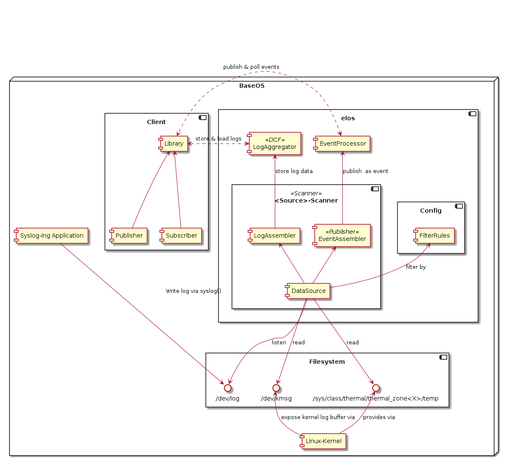

#### B) Logging is done by the EventProcessor

input
- Is a arbitrary data point (String, number , ...)
- Each input `Data` is an event if passes the filter criteria

processing:
- Each event is published
- Each published event gets logged by the LogAggregator in the EventProcessor


Commitment:

* Data is published as it is as event payload
* Each event is logged through LogAggregator
* Logging is done by EventProcessor
* Scanner has no knowledge about Data format
* Knowledge and Logic is possibly scattered through EventProcessor and LogAggregator


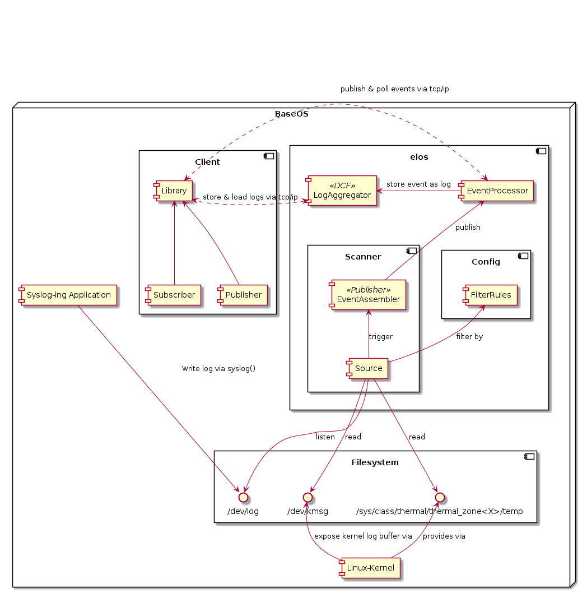


#### Conclusion

- We use A as :
  - Separate Log-Features from event handling (separation of concerns)
  - Better performance in the EventProcessor because we do not bother with logging
  - Knowledge and logic for new Log sources can be extended separately through shared library!


### elos

Elosd has the following tasks:

- Receive and dispatch events based on user defined event filters (EventProcessor)
- Persist certain event messages on a non volatile storage
- Maintain the scanner plugins (Scanner Manager)

#### The EventProcessor

Elos is required to accept messages from scanner plugins or different
applications generated through arbitrary events and dispatch them to corresponding
event lists (message queues).


##### communication patterns

Requirements:

- N to M communication (N message producer to M message consumer)
- Message producer do not need to know anything about message consumers

Possible approaches using a message broker architecture

- Central instance controlling publishing of message
- House keeping, resource control at a central known controllable point


1) Publish & Poll

The message dispatching follows the "publish & poll" or the "message queue / mailbox" communication pattern (https://en.wikipedia.org/wiki/Message_queue)

- Messages will be fetched by the client

2) Publish & subscribe

Others like the "publish & subscribe" communication pattern (https://en.wikipedia.org/wiki/Publish%E2%80%93subscribe_pattern) are in discussion if required.

- Message is directly pushed to the client, the client gets directly notified about new messages

##### Actual implementation

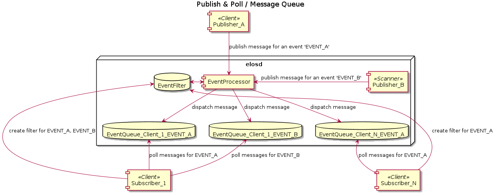

In general there are the following roles:

- EventProcessor<elosd>: 
  - Receives published events
  - Compares the received items with the previously configured EventFilters
    - Append the event to the EventFilter's EventQueue in case of a match
    - Drop the event in case there were no matches
  - Only one instance present (running multiple instances is not intended)

- Subscriber<client>:
  - Is a client
  - Registers for specific events based on EventFilterStrings
  - The number of subscribers is limited by design only by system resources
  - Subscribers connect via TCP/IP socket
  - Has to maintain an active connection represented by a session to  :
    - Poll for events on a regular basis
    - Keep created EventFilters and EventQueues alive
  - Number of EventQueues a subscriber can create is limited by the type of the EventQueueID
  - Currently EventFilterStrings are not shared or compared, so registering
    two times to receive events with (e.g.) messsage code 8004 will result in
    two fully independent EvenQueues.

- Publisher<client,scanner>:
  - Send events to the EventProcessor for distribution
  - Can publish an arbitrary amount of independent events per session/connection
  - Multiple publishers can publish the same event

- Client:
  - Can be any arbitrary process who is capable to connect to the elosd socket. (this includes remote process on other machines)
  - Can be both Subscriber and Publisher
  - Number is limited at least by CLIENT_MANAGER_MAX_CONNECTIONS + CLIENT_MANAGER_LISTEN_QUEUE_LENGTH

- Scanner:
  - Are dynamic loadable shared objects to extend the basic functionality of elosd by publishing arbitrary information directly via the EventProcessor
  - Not explicitly limited in number, but by system resources like open file descriptors or thread count

The relevant entities are related as follows:

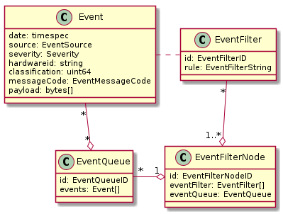

- Event
  - Is the entity which is published
  - Corresponds usually to one publisher, but it is not excluded that multiple
    publishers publish the same events (i.e. two publishers observing the syslog
    will publish the same log line)
  - Event lifetime depends on existing EventFilters and EventQueues,
    if the Event itself doesn't match any existing EventFilters while published,
    it is dropped, otherwise it will reside in an EventQueue until it is read
    or overwritten by newer Events.

- EventFilter
  - Receives a unique EventFilterID during creation
  - Exists only as long as the corresponding client has an active connection
  - Matches Events based on the given EventFilterString (e.g. events with messageCode 8004)

- EventQueue (message queue/box)
  - Receives a unique EventQueueID during creation
  - Exists only as long as the corresponding client has an active connection
  - Is limited in capacity, which can be controlled through the API
  - Drops oldest messages first on overflow

- EventFilterNode
  - Receives a unique EventFilterNodeID during creation
  - Exists only as long as the corresponding client has an active connection
  - Connects one or more EventFilters with one EventQueue
  - Allows for much easier Event processing ("if any EventFilter in
    EventFilterNode matches, add Event to EventQueue")

**Publishing**

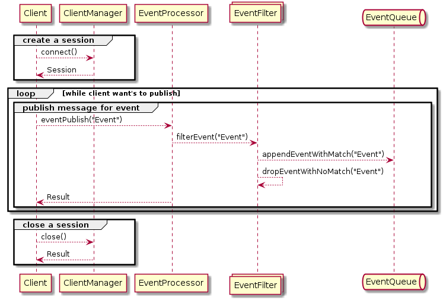

**Subscribing**

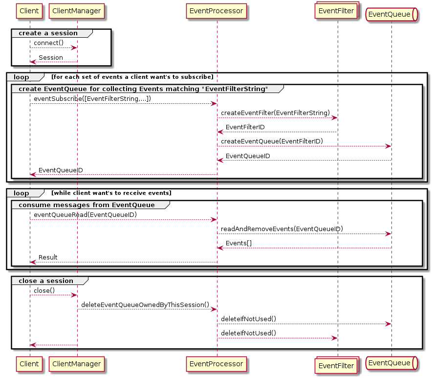

##### Design Decision – communication protocol


Requirements:

- Easy to extend and human readable
- Message producer do not need to know anything about message consumers
- "scale able" and therefore it works for a view as good for many participants,
  which means the number of participants can change constantly during runtime


Possible approaches :

A) Binary protocol

* More size efficient then text based
* Difficult to use i.e. on command line for shell scripting without dedicated utilities
* Not human readable
* BSON could be a possible solution
  * Extendable
  * More efficient then text based, due to no text parsing overhead


B) text based protocol

* Easy to use i.e. on command line
* Human readable
* Somewhat laborious to use in low level languages like C
* `json`
  * Readable but compact in size
  * Well known / supported
  * Structured and type support
  * Not as cycle efficient as binary protocols due to parsing overhead


Decision:

Use a JSON based protocol as:
* Is easy to extend , important for future feature requests
* Easy to use on command line, many tools/libraries available and proven in use
* Basic type support: possible to encode integer, floating points strings, objects/maps and arrays


##### Actual implementation

```json
{
  "date":[1362,682302528],
  "source": {"appName":"","fileName":"","pid":0},
  "hardwareid":"INVALID",
  "payload":"arbitrary data",
  "classification": 0,
  "severity": 0,
}
```

### Event Logging

The event logging system implements a data collection facility, which collects
events from different sources to filters and limits them in order to store
them. For details about the canonical event format see "canonical event
format".

The Event Logging system has the following main goals:

* filter events depending on filter settings
* limit events to log if a configured limit (logs per time) is exceeded
* optimize storage access to minimize IO operations and maximize physical
  storage lifetime

For the design the following assumptions are made: (TBD make some reliable measurements)

* the upper limit of available storage is 100GB
* an storage entity the event is round about <= 100Kb
* 10⁶ events; 100 event/s => 60H
* All events are treated equal / categorize events and apply different storage
  retention policies
* What is the minimal expected time frame to hold events (1a ?)
* 512 Bytes is smallest storage entity size (SSD/MMC always write at least 512 byte)


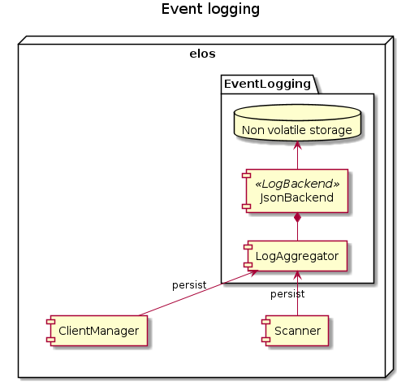

#### Log aggregation

The details on storing events shall be encapsulated by a component called
LogAggregator. This component is responsible for the following tasks:

* manage storage backend start, stop
* filter and limit event logs
* forward events to the actual storage backend to persist them
* manage concurrent storage requests
* manage retention policy, (trigger log cleanup, drop old logs )
* monitor storage backend health, generate notification about failing storage backend
* manage multiple backends (compile time or as loadable plugin?)

The Loggagregator is a shared instance in the elosd. So it has to synchronize
all attempts to persist an event.

##### LogAggregator - Detailed Design (API)

The LogAggregator interface is defined as follows:

```c
typedef struct elosLogAggregator {
    elosStorageBackend_t *backend;
} elosLogAggregator_t;

safuResultE_t elosLogAggregatorStart(elosLogAggregator_t *logAggregator);
safuResultE_t elosLogAggregatorAdd(elosLogAggregator_t *logAggregator, const elosEvent_t *event);
safuResultE_t elosLogAggregatorShutdown(elosLogAggregator_t *logAggregator);
safuResultE_t elosLogAggregatorFindEvents(elosLogAggregator_t *logAggregator, const char *rule, safuVec_t *events);
```


###### elosLogAggregatorStart

Initialize the event logging system. It initializes the configured storage backend and setup synchronization and filter functionality.

Function:

```c
safuResultE_t elosLogAggregatorStart(
    elosLogAggregator_t *logAggregator
    );
```

Parameters:
* `[in]` logAggregator -> a pointer to a logAggregator instance

Returns:
* SAFU_RESULT_OK -> on success
* SAFU_RESULT_FAILED -> on failure

###### elosLogAggregatorShutdown

Shutdown the logging system and free all related resources.

Function:

```c
safuResultE_t elosLogAggregatorShutdown(
    elosLogAggregator_t *logAggregator
    );
```

Parameters:
* `[in]` logAggregator -> a pointer to a logAggregator instance

Returns:
* SAFU_RESULT_OK -> on success
* SAFU_RESULT_FAILED -> on failure

###### elosLogAggregatorAdd

Queue an event to store on non volatile storage.

Function:

```c
safuResultE_t elosLogAggregatorAdd(
    elosLogAggregator_t *logAggregator,
    const elosEvent_t * event
    );
```

Parameters:
* `[in]` logAggregator -> a pointer to a logAggregator instance
* `[in]` event -> the event that will get stored

Returns:
* SAFU_RESULT_OK -> on success
* SAFU_RESULT_FAILED -> on failure

###### elosLogAggregatorFindEvents

Find all logged events that match a given filter rule. The events are gathered from the json backend.  
The filter rule, which will be applied to the events, is a comparision formula in string format  
i.e. ".event.source.appName 'exampleName' STRCMP". Events with elements matching the rule are appended  
to the third parameter, the event vector.

Function:

```c
safuResultE_t elosLogAggregatorFindEvents(
    elosLogAggregator_t *logAggregator,
    const char *rule,
    safuVec_t *events
    );
```

Parameters:
* `[in]` logAggregator -> a pointer to a logAggregator instance
* `[in]` rule -> a filter rule in string format
* `[in|out]` events -> an event vector, where elements will be appended

Returns:
* SAFU_RESULT_OK -> on success
* SAFU_RESULT_FAILED -> on failure


#### Logging Backend(s)

The actual storage process depends on the storage engine used. Therefore this
is abstracted in so called Storage backends. A storage backend takes one or
more events store them in the underlying storage engine. A storage engine could
be a simple file write, a database or any other solution that fits the needs
for the target system.

The interface of a storage backend consist basically of the following tasks:

* Backend open
* Backend store
* Backend close
* Realize required retention policy


The following Design Decision shall describe the decision process for the final storage backend to use.

##### Design Decision – Storage backend

A) JSON-File based

B) DBMS - SQLITE

C) Time series DB

D) NoSQL

E) Custom implementation

##### Storage backend Interface - Detailed Design (API)

The StorageBackend interface is defined as follows:

```c
struct elosStorageBackend;
typedef struct elosStorageBackend elosStorageBackend_t;

typedef safuResultE_t elosStorageBackendStart_t(elosStorageBackend_t *backend);
typedef safuResultE_t elosStorageBackendPersist_t(elosStorageBackend_t *backend, const elosEvent_t *event);
typedef safuResultE_t elosStorageBackendShutdown_t(elosStorageBackend_t *backend);

struct elosStorageBackend {
    const char *name;
    void *backendData;
    elosStorageBackendStart_t *start;
    elosStorageBackendPersist_t *persist;
    elosStorageBackendShutdown_t *shutdown;
};
```


###### elosStorageBackendStart

Initialize the event logging system. It initializes the configured storage backend and setup synchronization and filter functionality.

Function:

```c
typedef safuResultE_t elosStorageBackendStart_t(
    elosStorageBackend_t *backend
    );
```

Parameters:
* `[in]` backend -> a pointer to the backend instance

Returns:
* SAFU_RESULT_OK -> on success
* SAFU_RESULT_FAILED -> on failure

###### elosStorageBackendShutdown

Shutdown the logging system and free all related resources.

Function:

```c
typedef safuResultE_t elosStorageBackendShutdown_t(
    elosStorageBackend_t *backend
    );
```

Parameters:
* `[in]` -> a pointer to a backend instance

Returns:
* SAFU_RESULT_OK -> on success
* SAFU_RESULT_FAILED -> on failure

###### elosStorageBackendPersist

Writes the event to the underlying storage.

Function:

```c
typedef safuResultE_t elosStorageBackendPersist_t(
    elosStorageBackend_t *backend,
    const elosEvent_t *event
    );
```

Parameters:
* `[in]` backend -> a pointer to a backend instance
* `[in]` event -> a pointer to a event instance to persist

Returns:
* SAFU_RESULT_OK -> on success
* SAFU_RESULT_FAILED -> on failure

##### Json Backend - Detailed Design (API)

The JsonBackend interface is defined as follows:

```c
safuResultE_t elosJsonBackendStart(elosStorageBackend_t *backend);
safuResultE_t elosJsonBackendPersist(elosStorageBackend_t *backend, const elosEvent_t *event);
safuResultE_t elosJsonBackendFindEvents(elosStorageBackend_t *backend, elosRpnFilter_t *filter, safuVec_t *events);
safuResultE_t elosJsonBackendShutdown(elosStorageBackend_t *backend);

typedef struct elosJsonBackend {
    int storageFile;
} elosJsonBackend_t;
```


###### elosJsonBackendStart

Initialize the file backed storage of JSON serialized event objects. The
`elosStorageBackend_t.backendData` shall be initialized with a pointer to a
`elosJsonBackend_t` instance. `elosJsonBackend_t.storageFileWrite` and
`elosJsonBackend_t.storageFileRead` shall contain valid file descriptors to the
target file for writing/reading purposes. In write mode, the file shall be opened
for appending and synchronous writing, to ensure a write is carried out through
the kernel caches.

Function:

```c
safuResultE_t elosJsonBackendStart(
    elosStorageBackend_t *backend
    );
```

Parameters:
* `[in]` backend -> a pointer to the backend instance

Returns:
* SAFU_RESULT_OK -> on success
* SAFU_RESULT_FAILED -> on failure

###### elosJsonBackendShutdown

Shutdown the logging system and free all related resources.

Function:

```c
safuResultE_t elosJsonBackendShutdown(
    elosStorageBackend_t *backend
    );
```

Parameters:
* `[in]` -> a pointer to a backend instance

Returns:
* SAFU_RESULT_OK -> on success
* SAFU_RESULT_FAILED -> on failure

###### elosJsonBackendPersist

Writes the event to the underlying storage pointed to by `elosStorageBackend_t.backendData`. The function shall not call `sync` to flush kernel caches, as the file shall be opened with O_SYNC. The function shall block until the event is successful written to the storage backend.

Function:

```c
safuResultE_t elosJsonBackendPersist(
    elosStorageBackend_t *backend,
    const elosEvent_t *event
    );
```

Parameters:
* `[in]` backend -> a pointer to a backend instance
* `[in]` event -> a pointer to a event instance to persist

Returns:
* SAFU_RESULT_OK -> on success
* SAFU_RESULT_FAILED -> on failure

###### elosJsonBackendFindEvents

Applies a filter to a given storage backend. Events which weren't sorted out by the filter,
will be appended on the event vector.

Function:

```c
safuResultE_t elosJsonBackendFindEvents(
    elosStorageBackend_t *backend,
    elosRpnFilter_t *filter,
    safuVec_t *events
    );
```

Parameters:
* `[in]` backend -> a pointer to a backend instance
* `[in]` filter -> a filter that will be applied to the backend
* `[in|out]` events -> an event vector, where elements will be appended

Returns:
* SAFU_RESULT_OK -> on success
* SAFU_RESULT_FAILED -> on failure

### Event Filtering and Mapping

Elos has to convert arbitrary input into the canonical event format and filter
such events based on that format. The filter step is necessary to categorize
events and select them for further processing steps, like dispatching them to
the correct subscribers.

This leads to two kinds of event processing:

* Filtering: decide whether or not an event matches at least one rule and
  continue processing or drop the event
* Mapping: decide whether or not an input with it's processed event data
  matches a rule and assign a corresponding value to a property of an event.

The following diagram gives an overview of possible usages of `event filtering and mapping`.
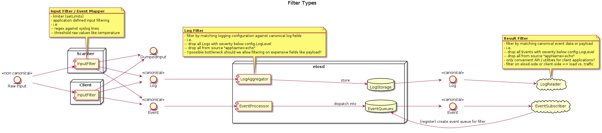

#### Mapping

The mapping is a specific task depending on the input and the meaning of those
inputs and their origin. Therefore it is necessary to have a generic component
which is capable of mapping values to the different canonical event properties
according to one or more configurable rules. A hard coded rule set will be not
flexible enough, as it is not possible to predict which programs are running on
the final system and to manage a mapping for all i.e. log lines of each
possible version of a program.

So for example to assign a message code to a new event depending on the
original input the `MappingComponent` needs the following inputs :

* A mapping rule
* The input
* The event with values already mapped
* A result, which should be applied if the rule matches

```
MappedVal = MappingRule(Input, Event, Val);
```

#### Filtering

Filtering of events can be achieved by a similar approach, the only difference
is that it is enough to know if a filter yields a `true` or `false`. A
`FilterComponent` requires the following inputs:

* A filter rule
* The event

```
Applies = FilterRule(Input, Event);
```

A rule should be a boolean expression and evaluates always to `false` or
`true`. To avoid continues parsing of rules a mechanism is needed that allows to
precompile rules and apply them on incoming events and or inputs. A rule given
as a string like `input == "open port" && event.source.appName == "ssh"` must
be parsed and prepared to be applied efficiently to incoming events.

To accomplish this the following components are necessary:

* A rule evaluation engine
* A rule source which provide rules
* A translation engine to prepare rules for the evaluation engine


#### Rule Sources

Rule sources in the elos context currently can be a configuration object or a
subscription from a client. In the first case rules can be mapping or filtering
rules. For the client subscription currently only filtering rules are useful.
But if a use case for mapping rules comes up it shall be possible to use them
there as well.

The rule strings shall be provided by the configuration as simple key value mappings:

```
4001: "event.severity == 2 && input == "some value" "
```

#### Translation engine

The translation unit shall parse the input rule and convert it into a valid
input sequence for the RpnFilter of the evaluation unit.

#### Rule evaluation engine

A state machine based on the Reverse Polish Notation (RpnFilter) is currently
used as the rule evaluation engine. The concept should be easily extensible by
additional engines that provide other implementations. For example a script
interpreter that provides the ability of stateful filtering can be plugged in
here.

##### RpnFilter

Fast and efficient message filtering. See the [RpnFilter Documentation](rpnfilter/rpnfilter.md) for more details.

##### EventProcessor

Abstract component to group components related to Event processing together.
See the [EventProcessor Documentation](eventprocessor/eventprocessor.md) for more details.

### Scanner Manager

Elosd allows to observe the system for certain events and publish them directly via the EventProcessor. The actual observation and publishing is done within the Scanners. The Scanner Manager has the task to maintain them.

- A Scanner:
  - Is a shared object that provides the Scanner-API by exporting the function symbols defined in scanner.h
  - Intended to publish messages for arbitrary events
  - Are not explicitly limited in number, but by system resources like open file descriptors
  - Is expected to achieve lower latency then publishing messages through tcp/ip

- Scanner Manager:
  - Locate shared object files that shall be loaded as Scanner
  - Instantiate, configure and run a Scanner in a separated thread
  - Stop and restart scanner if necessary


## Scanner

- A Scanner:
  - Is a shared object that provides the Scanner-API by exporting the function symbols defined in scanner.h
  - Intended to publish messages for arbitrary events
  - Are not explicitly limited in number, but by system resources like open file descriptors
  - Is expected to achieve lower latency then publishing messages through tcp/ip

### build'in scanner (examples)

- Syslog
- Kmsg

#### Syslog – Scanner

Serves as a syslog daemon and converts syslog lines into the canonical event format.

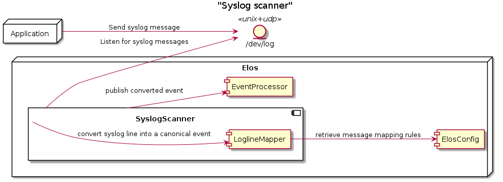

The format of syslog lines is defined in
* [The Syslog Protocol](https://datatracker.ietf.org/doc/rfc5424/) (most recent)
* [The BSD syslog Protocol](https://datatracker.ietf.org/doc/html/rfc3164) (obsolet but used by libc)

The current implementation can parse syslog lines according to the schema
produced by the glibc `syslog` function.
(see ["%h %e %T "](https://sourceware.org/git/?p=glibc.git;a=blob;f=misc/syslog.c;h=554089bfc45244e87c08eb0482e61c35dd0fa3ca;hb=HEAD))
The syslog socket is configured as an unix domain socket with UDP and
listen on `/dev/log`.


##### Configuration

###### Compile time:
* `ELOSD_SYSLOG_PATH` –> the path where to create a unix UDP socket to listen on, default is `/dev/log`

###### Environment:
* `ELOS_SYSLOG_PATH` –> the path where to create a unix UDP socket to listen on, default is `ELOSD_SYSLOG_PATH`

###### Configuration structure

The mapping rules are provided through the configuration. The configuration
(samconf) allows to lookup single options by a path like notation. So the
syslog scanner expect the following config structure:


```bash
SyslogScanner
├── SyslogPath
├── MappingRules
│   ├── MessageCode
│   │   ├── 4000
│   │   ├── 4001
│   │   └── 2001
│   └── ... (other like Severity, classification)
└── FilterRules (Not implemented)
    ├── empty payload
    ├── all from appName X
    └── containing secrets
```

The implementation for configuration files is still in progress so the format
for configuration files is not defined now.

##### Published events

* format is:
```json
[
  {
    "date": [
      284,
      0
    ],
    "source": {
      "appName": "sshd",
      "pid": 100
    },
    "severity": 3,
    "hardwareid": "ba9202e00b98474a892ca45f1bfb3624",
    "classification": 4,
    "payload": ": error: kex_exchange_identification: client sent invalid protocol identifier \"uhuhuhuhuh\""
  },
  {
    "date": [
      284,
      0
    ],
    "source": {
      "appName": "sshd",
      "pid": 100
    },
    "severity": 3,
    "hardwareid": "ba9202e00b98474a892ca45f1bfb3624",
    "classification": 4,
    "payload": ": error: send_error: write: Broken pipe"
  },
  {
    "date": [
      284,
      0
    ],
    "source": {
      "appName": "sshd",
      "pid": 100
    },
    "severity": 6,
    "hardwareid": "ba9202e00b98474a892ca45f1bfb3624",
    "classification": 4,
    "payload": ": banner exchange: Connection from 192.168.7.1 port 33720: invalid format"
  }
]
```

##### Implementation details

The syslog scanner shall preprocess an incoming syslog line according to the expected standard.

* [The Syslog Protocol](https://datatracker.ietf.org/doc/rfc5424/) (most recent)
* [The BSD syslog Protocol](https://datatracker.ietf.org/doc/html/rfc3164) (obsolete but used by libc)
* libc - syslog implementation of the target system

After the preprocessing the event have at least filled the following fields:

* date
* severity
* classification
* source (appName, pid)
* payload

The prepared event is then provided to all mapping rules found in the
configuration for
`/elos/Scanner/SyslogScanner/MappingRules/MessageCode/<appName>`.
The key of the first rule that matches will be applied as messageCode and the
event will be dispatched as intended.

If no rule matches we have to decide :

###### ADR - How to handle events without messageCode mapping

The problem to solve is, how to deal with events for which elos was unable to determine a messageCode.

Without a messageCode the event is probably not interpretable or meaningful for
a machine without parsing the payload.

*A) Use default mapping for messageCode*

If no messageCode mapping rule applies, the event can be tagged as
`Informational` (1000) or more specific with 1102 (Information). This way an
event will not get lost, the events can still be received with by a
subscription to the source identifier and/or severity and classification. The
messageCode indicates to the subscriber that elos was unable to map the event to a
specific messageCode and therefor to a meaning. So it is left to the subscriber
if he either tries to do some interpretation of the payload by himself or to simply
ignore the event.

No event will be lost in this scenario. But even broken messages or for some
special reason not mapped events will always be published.

*B) Drop event*

In case a messageCode can't determined by the mapping rules the event will be
dropped. This means the event is lost and will not be further processed, no
logging and no publishing occurs.

*C) Drop event and create a `drop event`*

An option to trace this behavior is to generate specific "Drop"-events. This
event shall have a messageCode for the elos reserved events (0-999) contain the
original source and payload of the dropped event. If available also the
severity and classification of the dropped event.

*D) omit the messageCode*

It could also be possible through the nature of the event structure, that the
messageCode is simply omitted. A messageCode equals to zero has currently the
meaning of "not provided". So omitting the messageCode could have a clear meaning
to the subscribers, "elos can't provide a messageCode for this event, use it or
leave it".

This way such events are not lost and the subscriber has to decide on their own if
they can deal with an event thats missing a messageCode.

####### Conclusion/Decision

###### severity - Mapping

The severity for the syslog protocol is defined as follows:

| Value | Description                                        |
|-------|----------------------------------------------------|
| 0     | Emergency: system is unusable                      |
| 1     | Alert: action must be taken immediately            |
| 2     | Critical: critical conditions                      |
| 3     | Error: error conditions                            |
| 4     | Warning: warning conditions                        |
| 5     | Notice: normal but significant condition           |
| 6     | Informational: informational messages              |
| 7     | Debug: debug-level messages                        |

The severity value can be obtained from the PRI value by calculating `pri % 8`.

The following table shows the mapping from syslog-severity to elos-severity values.

| Syslog-severity | elos-severity                                                               |
|-----------------|-----------------------------------------------------------------------------|
|              0  | Fatal   = 0x01  Fatal error, not recoverable.                               |
|              1  | Error   = 0x02  Error with impact to correct functionality.                 |
|              2  | Error   = 0x02  Error with impact to correct functionality.                 |
|              3  | Warn    = 0x03  Warning if correct behavior cannot be ensured.              |
|              4  | Warn    = 0x03  Warning if correct behavior cannot be ensured.              |
|              5  | Info    = 0x04  Informational, providing high level understanding.          |
|              6  | Info    = 0x04  Informational, providing high level understanding.          |
|              7  | Debug   = 0x05  Detailed information for programmers.                       |
|              -  | Verbose = 0x06  Extra-verbose debug messages (highest grade of information) |
|              -  | Off     = 0x00  No logging                                                  |

###### classification - Mapping

The syslog protocol defines a value to group the log messages by facility. The
following table list them and the corresponding elos classification value.


| Syslog-facility | Description                                      |elos classifaction (TBD)|
|-----------------|--------------------------------------------------|------------------------|
|               0 |  kernel messages                                 | 0x0000000000000001     |
|               1 |  user-level messages                             | 0x0000000000000000     |
|               2 |  mail system                                     | 0x0000000000000002     |
|               3 |  system daemons                                  | 0x0000000000000020     |
|               4 |  security/authorization messages                 | 0x0000000000000004     |
|               5 |  messages generated internally by syslogd        | 0x0000000000000000     |
|               6 |  line printer subsystem                          | 0x0000000000000000     |
|               7 |  network news subsystem                          | 0x0000000000000001     |
|               8 |  UUCP subsystem                                  | 0x0000000000000042     |
|               9 |  clock daemon                                    | 0x0000000000000000     |
|              10 |  security/authorization messages                 | 0x0000000000000004     |
|              11 |  FTP daemon                                      | 0x0000000000000002     |
|              12 |  NTP subsystem                                   | 0x0000000000000002     |
|              13 |  log audit                                       | 0x0000000000000004     |
|              14 |  log alert                                       | 0x0000000000000000     |
|              15 |  clock daemon (note 2)                           | 0x0000000000000000     |
|              16 |  local use 0  (local0)                           | 0x0000000100000000     |
|              17 |  local use 1  (local1)                           | 0x0000000200000000     |
|              18 |  local use 2  (local2)                           | 0x0000000400000000     |
|              19 |  local use 3  (local3)                           | 0x0000000800000000     |
|              20 |  local use 4  (local4)                           | 0x0000001000000000     |
|              21 |  local use 5  (local5)                           | 0x0000002000000000     |
|              22 |  local use 6  (local6)                           | 0x0000004000000000     |
|              23 |  local use 7  (local7)                           | 0x0000008000000000     |


###### date - Mapping

In older versions of the syslog protocol the date field doesn't provide a year
nor a timezone. The same is the case for the current development environment.
To solve this the syslog scanner assumes always the UTC timezone and applies
the current year to the date from the syslogline.

#### Kmsg - Scanner

Reads the kernel log ring buffer from /dev/kmsg and publishes depending on
pattern matching ([WIP] currently each line) as a "KMSG" event. The scanner
tries to open the configured file for reading, if it is not found at the
specified location it will try to create a FIFO node using `mkfifo()`.
Multiline kernel messages are not handled right now.

##### Published events

* `KMSG` –> each line read from /dev/kmsg is published as it is in the event payload field.
  But also parsed to set severity, classification and date of the published event. All events generated by the kmsg scanner have the message code 1111 "kernel log message".
  If the message could not be parsed for some reason severity and classification will stay empty and the message code is set to 3422 "message not understood".
  * format is:
  ```json
  {
      "date": [1684239716, 1668901000],
      "source": {
          "fileName": "\/dev\/kmsg"
      },
      "severity": 3,
      "classification": 1,
      "messageCode": 1111,
      "payload": "3,215,264071662,-;squashfs: Unknown parameter 'tmpfs'"
  }
  ```


##### Configuration

###### Compile time:
* `ELOSD_KMSG_FILE` –> the path where to open expect a character device or FIFO file node, default is `/dev/kmsg`

###### Environment:
* `ELOS_KMSG_FILE` –> the path where to open expect a character device or FIFO file node, default is `ELOSD_SYSLOG_PATH`


### Scanner-API

The ScannerManager loads and initializes a Scanner. After successful
initialization the ScannerManager calls the scannerRun method in a dedicated
thread. If the ScannerManager is asked to stop all or a particular Scanner, it
will signal it to the corresponding Scanner and join the Scanner threads.

The following diagram demonstrates the live cycle of a scanner.

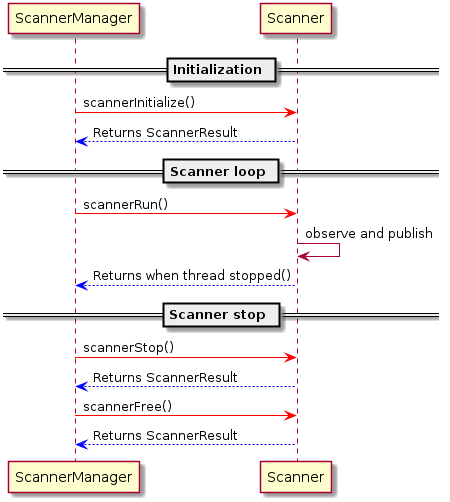

#### Howto implement a scanner

To implement a scanner simply extend the following code snippets or take one of the build'in scanner source as an example.


* Create a file example_scanner.c and with the following content:

```c
#include <stdio.h>

#include "elos/scanner/scanner.h"

elosScannerResultE_t elosScannerInitialize(elosScannerSession_t *session, UNUSED const elosScannerParam_t *param) {
    printf("[my scanner] is initializied\n");
    return SCANNER_OK;
}

elosScannerResultE_t elosScannerRun(elosScannerSession_t *session) {
    printf("[my scanner] is runnig\n");
    printf("[my scanner] has finished\n");
    return SCANNER_OK;
}

elosScannerResultE_t elosScannerStop(elosScannerSession_t *session) {
    printf("[my scanner] stop requested\n");
    return SCANNER_OK;
}

elosScannerResultE_t elosScannerFree(elosScannerSession_t *session) {
    printf("[my scanner] gets freed\n");
    free(session->context);
    return SCANNER_OK;
}
```

* compile it with :

```
gcc --shared -o example_scanner.so example_scanner.c -I elos/src/scanner/include/
```

* copy / install example_scanner.so to ELOS_SCANNER_PATH

```
cp testscanner/example_scanner.so $ELOS_SCANNER_PATH
```

* start elos and have a look for the log messages.
* extend to your use case


## Interfaces


### Library

The Library comes in form of a c library (libelos) and a header file. The library provides two APIs :

- Event-API:
  - Used to publish and subscribe to events
- LogAggregator-API (DCF-API)
  - Used to store logs (content of a log see SM_REQ001)
  - Used to access logs (content of a log see SM_REQ001)

#### Design decision – Thread Safety

> TBD: The library is intended to be thread safe and forkable, with no worker threads and synchronous input/output. 

#### Actual implementation

* The functions are documented in this section
* There is also a simple sequence diagram available further down below that shows how to interact with the server.

#### elosEventQueueRemove

Removes a previously created EventQueue.

```c
int elosEventQueueRemove(
        elosSession_t *session,
        elosEventQueueId_t eventQueueId
    );
```

Parameters:

* `[in]` session    -> session data structure
* `[in]` eventQueueId -> the id for the EventQueue that shall be removed

Returns:
* 0 for success or errorcode < 0 on failure


#### elosEventQueueSetLimit

Restrict the amount of events that can be recorded in a given timeframe.
This replaces the default values from the configuration file for
the specified EventQueueID.

```c
int elosEventQueueSetLimit(
        elosSession_t *session,
        elosEventQueueId_t eventQueueId,
        struct timespec timeframe,
        uint32_t events
    );
```

Parameters:

* `[in]` session      -> session data structure
* `[in]` eventQueueId -> the id for the EventQueue that shall be modified
* `[in]` timeframe    -> the timeframe in which the maximum amount of events can occur
* `[in]` events       -> the maximum amount of events that can occur in the specified timeframe

Returns:
* 0 for success or errorcode < 0 on failure


#### elosEventQueueGetLimit

Fetch the amount of events that can be recorded in a given timeframe,
these are either the default values from the configuration file
or the values set by the last `elosEventQueueSetLimit()` call.

```c
int elosEventQueueGetLimit(
        elosSession_t *session,
        elosEventQueueId_t eventQueueId,
        struct timespec *timeframe,
        uint32_t *events
    );
```

Parameters:

* `[in]`  session      -> session data structure
* `[in]`  eventQueueId -> the id for the EventQueue that shall be modified
* `[out]` timeframe    -> the timeframe in seconds in which the maximum amount of events can occur
* `[out]` events       -> the maximum amount of events that can occur in the specified timeframe

Returns:
* 0 for success or errorcode < 0 on failure

#### elosLogFilterCreate <TBD>

Creates a logFilter struct that can contain one or more rules for filtering log entries from the database during a read.

```c
int elosLogFilterCreate(
        elosSession_t* session,
        logFilter_t *logFilter,
    );
```


#### elosLogFilterAddRule <TBD>

Adds a new filter rule to the logFilter struct.

```c
int elosLogFilterAddRule(
        elosSession_t* session,
        logFilter_t *logFilter,
        logFilterRule_e logFilterRule, // <TBD> e.g. LOG_FILTER_RULE_TIMESTAMP
        const void* logFilterParam  // <TBD> e.g. a struct with timestamp values
    );
```


#### elosLogFilterDestroy <TBD>

Frees the memory associated with a logFilter struct.

```c
int elosLogFilterDestroy(
        elosSession_t* session,
        logFilter_t *logFilter,
    );
```


#### elosLogFindEvent

Fetches all logged events based on the used filter (e.g. based on payload or other data).

* In case no events are in the log, the vector parameter won't be changed.
* The memory of the event vector will be allocated by the library and must be freed afterwards with elosEventVectorDelete().

```c
int elosLogFindEvent(
        elosSession_t *session,
        const char *filterRule,
        elosEventVector_t **vector
    );
```

Parameters:

* `[in]`  session     -> session data structure
* `[in]`  filterRule  -> filter rule for entry selection
* `[out]` vector      -> list of event structs

Returns:
* 0 for success or errorcode < 0 on failure


##### JSON data structure example

* Each event will always have the fields **name**, **timestamp**, and **data**
* The **data** field is individual for each event type, they will be described in a separate section of this document.

```json
{
  "events": [
    {
      "name": "COREDUMP_STARTED",
      "timestamp": 1631720019,
      "data": {
        "pid": "1234",
        "exe": "/usr/bin/crashed_application",
        "corefile": "/tmp/coredump_with_identifiers"
      }
    },
    {
      "name": "TEMPERATURE_HIGH",
      "timestamp": 1631717420,
      "data": {
        "sensor_1": "71.0",
        "sensor_2": "63.7"
      }
    }
  ]
}
```

#### Example sequence diagram

This sequence diagram shows a simplified use case for polling for events.


