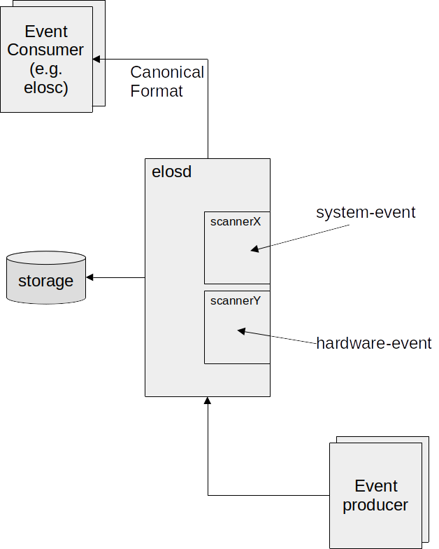

# elos

## Short Overview

The name "elos" means "event logging and management system" and describes a tool to collect, store and publish various system
information (i.e. syslogs, core dumps, measurements obtained from proc- and sys-fs, ...) while providing easy
access to the collected data for other programs and network clients.

To reach this goal, elos is using a so called canonical format, which means, that every collected data will
be provided in a normalized form, so all of the data from different sources gets structured and can be obtained
in the same way.



---

## Events

Elos uses events to communicate. Events can be exchanged over the network, so different clients may get them,
or they can get logged on the elosd server (to use the information later on). An event is structured in a "canonical
form", so an event does always contain the attributes: date, source, severity, hardware id, message code,
classification and payload.

The payload might be considered the most interesting part, since the original information gathered from
the system is stored there. However, the other metadata of the event might be of help too, for example, if
only certain events (lets say stored events from a certain date and time, that occurred at a specific hardware)
shall be examined, while all other events shouldn't get displayed.

The meaning of the different attributes is listed below:

```
* date: unix timestamp in seconds and nano seconds, the actual date of the event can be reconstructed from it
* source: the origin/software that created the particular information
* severity: when the message gets classified it is mapped to a severity value defined by this project
* hardware id: unique identifier of the hardware that produced the particular information
* message code: hides information (from security perspective), thus an information has a meaning without providing a payload
* classification: a set of flags to categorize events
* payload: the actual payload of the information (text, number, structs)
```

Note: To calculate the date from seconds and nanoseconds you can use the shell command:
`date -d@<seconds>.<nanoseconds> +%Y-%m-%d-%H:%M:%S.%N`

---

## Logging

Events can actually get stored in a json formatted log file, containing the information of the events described
above. This file is also considered the "json backend", since it is a database. The upper limit of the storage size
will be 100GB. The event logging is done separately by each event source, while not all events are automatically
logged. elos provides a server component named "EventProcessor" or "elosd" (elos daemon) containing a so
called "LogAggregator" to manage the retention police of the logging backend.

Here is an example how the json data of a stored event could look like:

```json
{
  "date": [1667929310,941892533],
  "Source": {
    "appname": "openssh",
    "filename": "/usr/bin/sshd",
    "pid": 208,
  },
  "severity": 1,
  "hardwareid": "817d6b97-75f8-4faf-ba3c-583ae1123558",
  "classification": 6,
  "messageCode": 8004,
  "payload": "failed to login user xy"
}
```
The value for `classification` is a concatenation of the flags `Network|Security`.

---

## Communication

The EventProcessor (or elosd server) works as a message broker, which receives and distributes events based on
previously defined event filters. The event communication is realized in a publish-poll pattern:
Clients interested in certain events will create an event filter on the server, which collects incoming matching
events in an event queue. A filter can relate to one or more members of an event. For example only events from a specific
aplication or with a specific severity could be collected. Listening clients must keep up the connection to the server, so
their filter and queues will exist further. When an event gets published by a client and doesn't match any existing filters,
it will be dropped. Otherwise it will reside inside matching event queues, until it is read or overwritten by
newer events. When listening clients want to get updated about their queues, they will need to actively
read / poll from the server.

---

## Filters

Along the above mentioned filters, elosd also uses a
different set of filters to decide if an event shall be kept in the logging
backend, or not.
Clients can read not only from their event queues, but also events from the logging backend.
To receive not all of them they will - again - use filters to decide which are relevant for them.
There are many more applications of filters in elos and usually they will
encountered as a configuration option which needs to specify some filter strings.

Filters are created from filter rules, so called RPN-Filter (Reverse Polish
Notation [https://wikipedia.org/wiki/Reverse_Polish_notation]) i.e.:
`".event.source.appName 'exampleName' STRCMP"` would compare the string stored
in the event source application name (parameter 1) to the string 'exampleName'
given as second parameter, while only events matching this string would be
received.

Another example is:
`".event.messageCode 42 EQ"`
where all events with the messageCode "42" would be obtained.

RPN-Filter rules use the following syntax:
```bash
rule: Term|Operant Operand Operator
Term: <Operand> <Operand> <Operator>
Operand: Process | Event | Value
Event: .event.<field>
Process: .process.<field>
Value: number|string
Operator: EQ|LT|LE|GT|GE|STRCMP|AND|OR
<field>: see chapter of corresponding filter type
```
### Event-Filter

Event-Filters are extended RPN-Filters, so they support the following
variables analogs to the canonical event format :

* `.event.source.pid` – match against process id of the source of an event
* `.event.source.appname` – match against application name the source of an event
* `.event.source.pid` – match against filename of the source of an event
* `.event.severity` – match against severity of an event
* `.event.hardwareid` – match against hardware id of an event
* `.event.classification` – match against classification of an event
* `.event.messageCode` – match against messageCode of an event
* `.event.payload` – match against payload of an event
* `.event.date.sec` – match against date of an event
* `.event.date.nsec` – match against date of an event

The `.event` identifier can be abbreviated with `.ev` or `.e`.

#### Examples

Only match events about core dump created :
```
.event.messageCode 5005 EQ
```

Only match events published by the 'init'-process
```
.event.source.pid 0 EQ
```

Only match events of unauthorized publishing attempt.
```
.event.messageCode 8007 EQ
```

Only match events of severity `warning` and above.
(note: severity is 1 == FATAL to 6 == VERBOSE )

```
.event.severity 3 LE
```

Only match events releated to security incidents with severity `warning` or higher.
(note: severity is 1 == FATAL to 6 == VERBOSE )

```
.event.classification 4 EQ .event.severity 3 LE AND
```

### Process-Filter

Process filters currently used to authorize processes to publish blacklisted
events. Process filters are extended RPN-Filters, so they support the following
variables:

* `.process.uid` – match against user id of the process
* `.process.gid` – match against group id of the process
* `.process.pid` – match against process id of the process
* `.process.exec` – match against executable path of the process

The `.process` identifier can be abbreviated with `.proc` or `.p`.

#### Examples

Only match process from `root` (uid==0) and `root` (gid==0) group:
```
.process.uid 0 EQ process.gid EQ AND
```

Only match the 'init'-process
```
.process.pid 0 EQ
```

Only match the process by executable and user group `publisher` (publisher with gid == 100)
```
.process.gid 100 EQ .process.exec '/bin/elosc' STRCMP AND
```

---

## Scanner

Events are gathered from different sources and different sources have different formats to show their information.
To put these information into the - in sections "Events" - introduced canonical event format, a translation is needed
from the original displayed data to our events. These translators are called scanners, since they are reading - or
better "scanning" - the original text to receive everything needed to form an event out of it.

Since literally every program can be an event source, scanners are implemented as plugins. You can create your own scanner,
receiving whatever data and integrate it in elos, as long as the output will be in canonical event form.

Common system events like syslog or kernel messages and core dumps are already handled by scanners shipping with elos.

Depending on the installation on the local system, it might be necessary to set  ```ELOS_SCANNER_PATH``` to the directory where the scanner libraries are installed.

### Syslog Scanner

The "system logging protocol" (syslog) is a standard protocol to transfer log messages. A syslog message is smaller
than 1024 byte and consists of a header and the message that shall be transferred itself. The header does split up
in the fields: priority, version, timestamp, hostname, app-name, procid, msgid and structured data. Since some of
the values are comparable with the attributes in our canonical event format, the syslog scanner will map them. An
example for a syslog message is:
```
<38>Jan  1 01:41:57 sshd[240]: Server listening on :: port 22.
```

While the event we create from it could contain the following data:

```
date = [1641001317,0]
severity = 6
source = {"appName":"sshd","pid":240}
hardware id = "4bfa155647104435a92b2a27486fd72c"
classification = 4
messageCode = 2007
payload = "Server listening on :: port 22."
```

### Kmsg Scanner

The kernel message (kmsg) scanner reads the kernel log ring buffer from the system file /dev/kmsg. The main idea of this file
is to collect all the information about the initial phase of the system startup and store it until a syslog daemon (which
is a receiver for syslog messages mentioned above) got started to pick them up. The file will also receive kernel messages
later on, i.e.: When a new usb device was plugged in.

Each line of the kmsg file will be treated as payload of a single event, while additional metadata will be created. The maximum
readable size of an entry is 4096 bytes. A kmsg line might look like this:
```
30,744,16663194,-;systemd[1]: Listening on Syslog Socket.
```

The event created from this could look something like this:

```json
{
    "date": [1684239716, 1668901000],
    "source": {
        "fileName": "\/dev\/kmsg"
    },
    "severity": 4,
    "classification": 32,
    "messageCode": 1111,
    "payload": "30,744,16663194,-;systemd[1]: Listening on Syslog Socket."
}
```
To subscribe on kernel log messages use a filter like '.event.messageCode 1111 EQ', as the message code 1111 stands for "kernel log message".
If the message could not be parsed the message code is set to 3422 (message not understood), severity and classification won't be set in that case.

### Netifd Scanner

Netifd is part of the OpenWrt project (a distribution for embedded devices - typically wireless routers). Netifd means
"network interface daemon" so its purpose is to manage network configurations. "Interfaces" represents configurations for
one or more devices in it, while devices represents either a physical linux interface (e.g. eth0), or a virtual link.
All device state transitions are announced via events i.e.: If a network interface is up or down. The contents of the
netifd events will be mapped by our netifd scanner to create canonical events out of it.

---

## Elos-Tools


### Elos-coredump

Elos-coredump is an application to create events to be logged to the elos log, when a segmentation fault occurs and a
coredump file is to be created. Following is an example of an event created by elos-coredump and logged in elos log


```json
{
  "date":[203,0],
  "Source": {
     "appName":"\/bin\/busybox.nosuid",
     "fileName":"\/bin\/busybox.nosuid",
     "pid":475
  },
  "severity":1,
  "hardwareid":"eb-arm64",
  "classification":512,
  "messageCode":5005,
  "payload":"core dumped to \/tmp\/core.203.475, signal=6, UID=0, GID=0"
 }
```

#### Elos-coredump Installation

The elos-coredump tool is built and installed along with elos as given in the [installation section](#elosd-installation-setup).
After installation is complete, the kernel core-pattern needs to be setup to ensure that coredumps are piped to elos-coredump.
This can be achieved by running ```elos-coredump``` as ```root```. This run, sets the value ```|<PATH_TO_COREDUMP_BINARY>/elos-coredump %P %E %u %g %s %t %h```
in the ```/proc/sys/kernel/core_pattern``` file.

#### Usage

To run elos-coredump manually the following arguments are required :

```
  expected order of specifiers:

  %P %E %u %g %s %t %h

   where:
   %P: PID of dumped process
   %E: Pathname of executable, with slashes ('/') replaced by exclamation marks ('!')
   %u: Numeric real UID of dumped process.
   %g: Numeric real GID of dumped process.
   %s: Number of signal causing dump.
   %t: Time of dump, expressed as seconds since the Epoch, 1970-01-01 00:00:00 +0000 (UTC).
   %h: Hostname

```
See manpage (man 5 core) for more details about core pattern and the different specifiers used here.

When elos-coredump is run manually it is not necessary for the core patterns, to be set. They can be set
in the call to run elos-coredump as illustrated below.

```

# subscribe to to a coredump event
root@eb-arm64:~# elosc -s ".event.messageCode 5005 EQ" &
root@eb-arm64:~# Connecting to elosd...
Get elosd version...
  Elosd version is '0.38.9.20c39c7b'
  subscribing with filterRule '.event.messageCode 5005 EQ'
  polling for new events...

# Trigger coredump by passing required arguments to elos-coredump
root@eb-arm64:~# echo "THIS IS THE DUMP" | /usr/bin/elos-coredump 1 /usr/bin/somebinary 2 3 11 333333 myhostname
coredump started
wrote coredump file '/tmp/core.333333.1' with 17 bytes
connecting coredump to event log scanner...
send coredump event to log scanner...
disconnecting coredump from event log scanner...
coredump done

# subscribed elos client captures coredump event
root@eb-arm64:~#   new data [5964,163307136]:
[{"date":[333333,0],"Source":{"appName":"\/usr\/bin\/somebinary","fileName":"\/usr\/bin\/somebinary","pid":1},"severity":1,"hardwareid":"myhostname","classification":512,"messageCode":5005,"payload":"core dumped to \/tmp\/core.333333.1, signal=11, UID=2, GID=3"}]

# Coredump file with given coredump data
root@eb-arm64:~# ls -lah /tmp/core.333333.1
-rw-r--r--    1 root     root          17 Jan  1 01:39 /tmp/core.333333.1
root@eb-arm64:~# cat /tmp/core.333333.1
THIS IS THE DUMP

```

An Example of how a coredump shall be piped to elos-coredump via core_patterns is demonstrated below.

```

#set core pattern
root@eb-arm64:~# elos-coredump
coredump started
coredump called without parameter - setup core_pattern
coredump core_pattern setup done

#check is core pattern is set
root@eb-arm64:~# cat /proc/sys/kernel/core_pattern
|/usr/bin/elos-coredump %P %E %u %g %s %t %h

# subscribe to to a coredump event
root@eb-arm64:~# elosc -s ".event.messageCode 5005 EQ" &
root@eb-arm64:~# Connecting to elosd...
Get elosd version...
  Elosd version is '0.38.9.20c39c7b'
  subscribing with filterRule '.event.messageCode 5005 EQ'
  polling for new events...

# trigger an coredump
root@eb-arm64:~# sleep 100 &
root@eb-arm64:~# pgrep sleep
475
root@eb-arm64:~# kill -ABRT 475

[2]+  Aborted (core dumped)      sleep 100

# Triggered coredump generates an new event and it is logged.
# Logged event is then accessible to subscribed elos client.
root@eb-arm64:~#   new data [203,936636528]:
  [{"date":[203,0],"Source":{"appName":"\/bin\/busybox.nosuid","fileName":"\/bin\/busybox.nosuid","pid":475},"severity":1,"hardwareid":"eb-arm64","classification":512,"messageCode":5005,"payload":"core dumped to \/tmp\/core.203.475, signal=6, UID=0, GID=0"}]

# coredump file created by default in /tmp
root@eb-arm64:~# ls -lah /tmp/core.203.475
-rw-r--r--    1 root     root      296.0K Jan  1 00:03 /tmp/core.203.475

```

## elosd - Installation & Setup

This section will cover the topic of how elos has to be installed.
If you have elos already installed in an image, you can safely skip this chapter.
First of all: We have to make a difference between the elos daemon (elosd) which
is the server application and can be considered elos itself, and elos clients (which will be
named elosc onwards) where - in fact - no installation is needed: As long as messages are send in the right way, the elosd
will answer you. You might communicate with it from a different device just using the terminal. However, we do have an
elosc demo program to simplify the communication. But let's start with the main thing.

### Get elos Project

Elos sourcecode is located in a git repository.

### Build And Installation

As soon as you have elos, you need to build it. elos has different dependencies. To install all the dependencies in a Debian based system, execute:

```
sudo apt install -y locales build-essential binutils-dev pkg-config cmake ninja-build libcsv-dev libcmocka-dev \
zlib1g-dev libiberty-dev wget jq libjson-c-dev curl gdb netcat net-tools linux-tools-generic libssl-dev openssl \
sqlite3 libsqlite3-0 libsqlite3-dev
```

Then navigate to the directory where you have stored the elos project and use the following command lines to build and install it:

```
cmake -B ./build-safu/ ./safu/ -D UNIT_TESTS=OFF
make -C build-safu/
sudo make -C build-safu/ install

cmake -B ./build-samconf/ ./samconf/ -D UNIT_TESTS=OFF
make -C build-samconf/
sudo make -C build-samconf/ install

cmake -B ./build-elos/ ./elos/ -D UNIT_TESTS=OFF
make -C build-elos/
sudo make -C build-elos/ install

sudo ldconfig
```
These libraries will create our software parts: safu, samconf and elos. Since elos depends on safu and samconf, the correct
build-order is important. If a build failed for whatever reason, just delete the build directory, solve the problem written in text
and try again.

The last instruction (ldconfig) updates the symbolic links for shared libraries, since we added a few and elos needs to find them.

If these lines of code succeeded, than congrats: You have successfully installed a working elos daemon.

#### Packing
Creating the debian packages for elos and the other elos tools is possible by
calling
```
shared/ci/package_all.sh
```
from the ```/base``` directory inside the docker container.

Other ways to generate the packages are by calling
```
ci/build.sh --package
ci/package.sh
```
inside each subprojects directory, inside the docker container.

In general, by reconfiguring the paths inside each subprojects ```Packing.cmake```
to work outside the docker, it is possible to build a subprojects package with:

```
cmake -B <build_dir> <project_dir> -D UNIT_TESTS=ON -D PACKAGE=ON -D CMAKE_BUILD_TYPE=Release
make -C <build_dir>
make -C <build_dir> install
cd <build_dir>/Release/cmake
cpack -G DEB
```

---

### Setup To Make It Work

There are still a few steps remaining to configure it correctly:

```
sudo mkdir /etc/elos/
sudo cp elos/src/elosd/elosd.json /etc/elos/
```
Copies the elosd.json file from our project to /etc/elos. This file is mandatory, to tell elos, where to find its scanner, backend-
log-file and network ports to communicate. Therefore, it is filled with standard values while the user might want to change a few
directories according to personal system settings and preferences. A description of file contents can be found in the next section.

```
sudo touch /var/log/elosd.log
sudo chown "$USER":"$USER" /var/log/elosd.log
```
Creates the elosd json backend file at its standard location. Received events will get stored in it line-by-line.
You can change the location to another place if you like, in the way described below.

---

## elosd Configuration - Options Explained

By default the elosd config options, stored in '/etc/elos/elosd.json' do look like this:

```json
{
    "root": {
        "elos": {
            "UseEnv": false,
            "Port": 54321,
            "Interface": "127.0.0.1",
            "LogFilter": "client_manager.c;dispatcher.c;message_handler.c;message_event_create.c;message_event_push.c",
            "LogLevel": "DEBUG",
            "EventBlacklist": ".event.messageCode 2000 EQ",
            "authorizedProcesses": [
              ".process.uid 0 EQ .process.gid 0 EQ .process.exec '/bin/elosc' STRCMP AND",
              ".process.gid 200 EQ .process.exec '/bin/elosc' STRCMP AND",
              ".process.pid 1 EQ"
            ],
            "EventLogging": {
                "PluginSearchPath": "/usr/lib/x86_64-linux-gnu/elos/backend",
                "Plugins": {
                    "Dummy": {
                        "File": "backend_dummy.so",
                        "Run": "always",
                        "Filters": [
                            "1 1 EQ"
                        ]
                    },
                    "JsonBackend": {
                        "File": "backend_json.so",
                        "Run": "always",
                        "Filters": [
                            "1 1 EQ"
                        ]
                    }
                }
            },
            "StorageBackend": {
                "Json": {
                    "File": "/var/log/elos/elosd_event.log"
                }
            },
            "Scanner": {
                "Path": "/usr/local/lib/elos/scanner",
                "KmsgScanner": {
                    "KmsgFile": "/dev/kmsg"
                },
                "SyslogScanner": {
                    "SyslogPath": "/dev/log",
                    "MappingRules": {
                        "MessageCodes": {
                          "4000": ".event.source.appName 'ssh' STRCMP",
                          "2000": ".event.source.appName 'crinit' STRCMP",
                          "1000": ".event.source.appName 'login' STRCMP"
                        }
                    }
                }
            }
        }
    }
}
```
These options are used if the UseEnv variable is set to false. Otherwise elos will use environment variables (if there are any defined).
The elosd options are listed below in order top to bottom. The name of the environment variable you might want to use in case you set
"UseEnv" to true, will be attached in brackets (). If UseEnv is true and the respective environment variables are not set, the config
option will be used instead. If the config option is missing or not readable, elos will use another default value, decided by us.

* **UseEnv**: Define if elosd will allow overwrite configuration values by environment variables
* **Port**: The network port number elosd shall use (`ELOSD_PORT`, default value: `54321`)
* **Interface**: The IPv4 address the elosd server will have (`ELOSD_INTERFACE` default value: `"0.0.0.0"`)
* **LogFilter**: Only log messages from these C-Files are shown, don't touch it except you know what you're doing (`ELOS_LOG_FILTER` default value: `""`); files are separated by `;` i.e. `"first.c;second.c"`
* **LogLevel**: Severity levels deciding how much information will be printed from no messages to extremely detailed the levels are:
Off, Fatal, Error, Warn, Info, Debug and Verbose (`ELOS_LOG_LEVEL` default value: `"Debug"`)
* **EventBlacklist**: Event filter that filters events into critical and non-critical events so that critical events cannot be published by unauthorized clients.
* **authorizedProcesses**: A list of process filters that determines if a client is authorized to publish critical events.
* **StorageBackend/Json/File**: The file where elosd will store all the logged events (`ELOS_STORAGE_BACKEND_JSON_FILE`)
* **Scanner/Path**: Path to the scanner plugins (`ELOS_SCANNER_PATH` default value: `"/usr/lib/elos/scanner"`)
* **Scanner/KmsgScanner/KmsgFile**: Character device or FIFO file node to receive logs in kmsg format from (`ELOS_KMSG_FILE` default value: `"/dev/kmsg"`)
* **Scanner/SyslogScanner/SyslogPath**: Unix UDP socket to receive logs in syslog format from (`ELOS_SYSLOG_PATH` default value: `"/dev/log"`)
* **Scanner/SyslogScanner/MappingRules/MessageCodes**: contain `message code, filter` pairs to set a specific `message code` for an event if the given filter matches the event.

Note: You can create/overwrite environment variables by typing something like i.e.: `export ELOSD_PORT='1234'`
If you want to store them permanently, you can add them to your `~/.bashrc` file.
You can also change the location where elosd expects its configuration by setting the environment variable 'ELOS_CONFIG_PATH'


### Event Authorization

Event authorization is implemented by setting two filters in the config file. The two filters are :

* EventBlacklist: This is an event filter which separtes an event into critical and non-crtical events and blacklists it, if critical, to prevent it from being published by an
unauthorized client.

* authorizedProcesses: This is a list of process filters which determines if a client is an authorized process, so that the client is able to publish
critical events.


Only an authorized process i.e. those that match any of the `authorizedProcesses` filter in the config can publish any event, even those events that match
the `EventBlacklist` filter in the config. Other clients will be able to publish only those events that do not match the `EventBlacklist` filter.

#### Dependency

It is assumed that the system has the following dependencies to use this feature

* Linux kernel with netlink and `inet_diag` enabled:
```
CONFIG_NETLINK_DIAG=y
CONFIG_INET_DIAG=y
CONFIG_TCP_DIAG=y
```
* elos needs to run as root
* libmnl library is installed

---

## elosd Start and Test

After all the settings are done, the elos daemon can be started for debugging with i.e.:
```
sudo ELOS_LOG_LEVEL=DEBUG elosd
```
Since the daemon needs a log level to decide which messages shall be printed and which not. The "sudo" is necessary to enable the
elosd to receive the kernel message log (kmsg) and the syslog, or otherwise, the kmsg and syslog scanners won't work.

The syslog scanner tries per default to climb the unix DGRAM socket /dev/log to receive syslog messages. Please keep in mind that this
path can also be changed in the config options, which is especially recommended on systems that are already monitoring /dev/log with
systemd. If /dev/log is already taken, elosd won't be able to open it.
(You can find out if this is the case on your system, when you type `journalctl -f` and get a log response from systemd, or simply
type `ls -lah /dev/log` before starting elos the first time, to check if this path already exists.)

Regardless if different scanners are working or not, the terminal which started elosd should end with the message:
```
[ELOSD] Running...
```
Now you will be able to send messages to elosd and get them logged.

You can test to send and receive a message by typing:
```
elosc -s ".event.source.appName 'sshd' STRCMP" &
```
in a new terminal which starts a listening client for events from the sshd.
Then use another terminal and type:
```
elosc -p '{"Source": { "appName":"sshd"}, "payload": "test"}'
```
To push the event behind the "-p" to the server. Since the filter given to the subscribe command matches the pushed event,
the event will be transmitted to it. You should see an output on the listening terminal that looks like:
```
   new data [1669298051,246902710]:
[{"date":[1669298051,236492733],"Source":{"appName":"sshd"},"payload":"test"}]
```

Similarly
```
elosc -f ".event.source.appName 'sshd' STRCMP"
```
will find events which already happened which find events which already happened that match the given filter rule.
```
new data:
{"date":[1669297969,738218916],"Source":{"appName":"sshd"},"payload":"test"}
```
---

## [Event-Inputs] Scanner Setup

Since scanners are like plugins and we can have a different amount of them, which are working all differently, we decided to
create a generic component which is capable of mapping values to the different canonical event properties according to one
or more configurable rules. These mapping rules can be defined in configuration files for the scanners.
This makes it easy to define new scanners and add them to the elosd. Refer to the documentation on how to
write a new scanner.

So for example to assign a message code to a new event depending on the original input the `MappingComponent` needs the following
inputs :

* A mapping rule
* The input
* The event with values already mapped
* A result, which should be applied if the rule matches

When creating a mapping or filter rule, you can use the following filter names:
- ".event.source.pid": Filter by the process id of a source
- ".event.source.appName": Filter by the software name of a source
- ".event.source.file": Filter by the executable/file name of a source
- ".event.severity": Filter by the severity of the event
- ".event.hardwareid": Filter by the hardware id given to the event
- ".event.messagerCode": Filter by the message code assigned to the event
- ".event.payload": Filter by the message of the event, only supports exact matches

A single mapping rule maps an event to a rpn-filter rule. RPN-Filter rules use the following syntax:
```bash
rule: Term|Operant Operand Operator
Term: <Operand> <Operand> <Operator>
Operand: Event | Value
Event: .event.<field>
Value: number|string
Operator: EQ|LT|LE|GT|GE|STRCMP|REGEX|AND|OR
```
Some simple examples are:
```bash
# always true
1 1 EQ
# always false
1 0 EQ
# true if event has payload equals to 'Hugo hat husten'
.event.payload 'Hugo hat husten' STRCMP
# true if payload contains ip from 192.168.7.1/24
.event.payload r'192\.168\.7\.[0-9]{1,3}' REGEX
```

### Syslog Scanner

The syslog scanner expects the following config structure:

```bash
SyslogScanner
├── SyslogPath
└── MappingRules
    ├── MessageCode
    │   ├── 4000
    │   ├── 4001
    │   ├── 2001
    │   └── ... (more MessageCodes)
    └── ... (other event attributes like Severity, Classification, ...)
```

The MappingRules are provided through the configuration. The configuration (samconf) allows to lookup single options by a path like notation.

```bash
4000: ".event.source.appName 'ssh' STRCMP"
4001: ".event.severity 3 EQ"
```


### Kmsg Scanner

Reads the kernel log from `/dev/kmsg` or from a file pointed to by ELOS_KMSG_FILE environment variable. The file shall be created with mkfifo.

## [Event-Ouputs] Event Logging Backend Configuration

Depending on the installation on the local system, it might be necessary to set 
```ELOS_BACKEND_PATH``` to the directory where the backend plugin libraries are installed.


### Plugins
It is possible to create logger instances by configuring instance of logger plugins
in the elosd config file.
Using the json configuration as an example, defining an instance of a logger plugin
could look like the following:

```json
{
    "root": {
        "elos": {
            "EventLogging": {
                "PluginSearchPath": "/usr/lib/x86_64-linux-gnu/elos/backend",
                "Plugins": {
                    "<Instance Name>": {
                        "File": "<.so File(eg. backend_json.so)>",
                        "Run": "<Always/Never>",
                        "Filter": [ "<array of RPN-filters>" ],
                        "Config": {
                            "": "Map of Plugin specific configuration options"
                        }
                    }
                }
            }
        }
    }
}
```

It is possible to use the same .so Files for multiple instances, with different names, filters and configurations.


```json
"Plugins": {
    "JsonBackend": {
	"File": "backend_json.so",
	"Run": "Always",
	"Filter": [ "1 1 EQ" ],
	"Config": {
		"StoragePath": "/tmp/elosd.log"
	}
    }
}
```
Would configure a backend named "JsonBackend" using the json backend library.
Per configuration it would be started on elosd startup, and it would log all
incoming messages to /tmp/elosd.log. "StoragePath" is a json_backend.so specific
configuration, refer to its chapter for more detail.

Currently, only the ```Run``` options ```Always``` and ```Never``` are supported,
but in the future, other options could be included to allow for deferred startup
of a plugin instance, if necessary for other services like network interfaces,
for example.

#### Json Backend Plugin

This is changeable by either configuring the option "StoragePath" unter "Config",
or by defining ```ELOS_STORAGE_BACKEND_<PLUGIN NAME>_FILE``` in the enviroment.
If defined the enviroment variable takes precedent over the file configuration.
The definition of "StoragePath" is mandatory, but it can be defined as empty,
in which case the default value, ```/var/log/elosd.log``` will be used.

Another, in its case optional, configuration option is "Flags", which allows
to define additional flags with which the log file is opened. If specified,
its value is a json list of strings contaning all options that are additionally
wanted.
Currently the following list of flags are possible to be used:
- ```O_NOATIME```
- ```O_DIRECT```
- ```O_SYNC```
- ```O_DSYNC```

As long as the value is a valid json list, any unspecified or non-string option
will simply be ignored with a warning, instead of creating an error and exitting.

An example configuration of two coexisting json backend loggers using all options
could look as following:
```json
"Plugins": {
    "RegularLog": {
        "File": "backend_json.so",
        "Run": "Always",
        "Filter": [ ".messageCode 5005 NE" ],
        "Config": {
            "StoragePath": "/tmp/elosd_%host%_%date%_%count%.log",
            "Flags": ["O_DSYNC", "O_NOATIME"],
            "DateFormat": "%m-%d-%Y",
            "PathSizeLimit": 1000
            "MaxSize": 100000
        }
    },
    "CoreDump": {
        "File": "backend_json.so",
        "Run": "Always",
        "Filter": [ ".messageCode 5005 EQ" ],
        "Config": {
            "StoragePath": "/tmp/coredump.log",
            "Flags": ["O_SYNC", "O_DIRECT"]
        }
    }
}
```
This configures two loggers, one logging all non-coredump events to /tmp/elosd.log,
which is opened using the ```O_DSYNC``` and ```O_NOATIME``` options. The second
one logs all coredump events to /tmp/coredump.log using the ```O_SYNC``` and
```O_DIRECT``` options.

The first logger additionally uses variables for its logs name, as well as log
rotation. The ```%*%``` macros get replaced by following values:
- host: the host machines name as registered by safu
- date: the date of creation of the file
- count: a counter numbering files with, besides the counter, exactly the same
	filename.

The DateFormat field, which the first logger has defined is an optional field
that defines the format of the date which replaces ```%date%```. This formatting
uses the strftime function of time.h and the string and its conversion follows
strftimes conversion specifications. If DateFormat is not given, the used format
string is ```%Y%m%d```.

If ```%date%``` is defined, date-based log rotation gets enabled.The log files
gets rotated whenever the formatted date string for the file changes. This
allows to configure a rotation every second, but also every year, depending on
the dates format string.

The MaxSize field defines an upper limit for a json loggers log file size.
When the file reaches the size limit, and ```%count%``` is defined,
the logfile will rotate. It is necessary to make this rotation dependend on
```%count%``` to ensure the uniqueness of the new filename after the rotation.
If MaxSize is not set, it will default to a maximum size of 10000 bytes. This
default value can be overwritten by setting the define
```ELOS_JSON_LOGGER_MAX_FILE_SIZE``` during compile time.

The PathSizeLimit field is another optional field, which limits the size of
the, macro resolved, file path. If the final file path exceeds the limit, the
logging file path will default to ```/var/log/elosd.log```. This can be changed
by defining ```STORAGE_LOCATION``` at compile time.

If PathSizeLimit itself is not set, it will default to 1024. This value can be
changed by defining ```ELOS_JSON_LOGGING_PATH_LIMIT_DEFAULT``` at compile time.

#### SQL Backend Plugin
The SQL Backend Plugin implements a logging backend using sqlite3.
The code for it is an unofficial Proof-of-Concept implementation that might be
changed or removed at any moment without prior notice.

Configuration for it is similar to other plugins and look as follows:
```json
"<Instance Name>": {
    "File": "backend_sql.so",
    "Run": "<always/never>",
    "Config": {
        "ConnectionPath": ""
    }
}
```
Connection Path configures the path to the storage database file for sqlite3.
The option is optional. If the option is omitted, instead the value of the the
enviroment variable ```ELOS_STORAGE_BACKEND_SQL_CONNECTION```is used. If the
variable is not set, the default value ```/var/db/elosd.sqlite``` will be used.

## Elosc as demo application to verify

Using the elos client (elosc), it is possible to interact with the running EventProcessor (elosd).
The following options are available:
```bash
-s <filter rule>	subscribe to event	Subscribe to events matching the given filter rule.
-f <filter rule>	search for event	List all events matching the given filter rule
-p <event>		push events		create elos events using the canonical form and push the to the elosd
-c n			set count		set maximum amount of shown results
-r n			set rate		set rate with which events are received or pushed at
-v			show version
```
Refer back to [elosd Start and Test](## elosd Start and Test) for some basic examples.
For a more comprehensive view, look at the following examples:

```bash
elosc -s "1 1 EQ" # Subscribe to all
elosc -s ".event.messageCode 42 EQ" # Subscribe to all events with messageCode 42

# To search the event log (historical events):
elosc -f "1 1 EQ" # find all events
elosc -f ".event.messageCode 42 EQ" # find all events with messageCode 42

# find all events with messageCode between 400 and 500
elosc -f ".event.messageCode 400 GE .event.messageCode 500 LE AND"
elosc -f ".event.payload 'Hugo' STRCMP .event.messageCode 43 EQ AND"

# Find all successful ssh logins
elosc -f ".event.source.appName 'sshd' STRCMP .event.payload r'Accept' REGEX AND"

# To publish events:
elosc -p '{"messageCode": 101, "severity":42, "payload":"ping", "Source": {"appName": "elos_fs_test"}}'
elsoc -p '{}' # will result in an event with only the date set

# send an event 10 times as fast as possible
elosc -c 10 -p '{"messageCode": 101, "severity":42, "payload":"ping", "Source": {"appName": "elos_fs_test"}}'

# send an event 100 times with a rate of 10Hz
elosc -c 100 -r 10 -p '{"messageCode": 101, "severity":42, "payload":"ping", "Source": {"appName": "elos_fs_test"}}'
```

## elosMon demo client

Another example is the included demo client elosMon, which enables the user to subscribe for certain events with the elos daemon and get notified if these events occur. This can be used to keep track of coredumps in testing environments or to get notified on suspicious logins:

```
# Get notified on logins from a specific network
elosMon -v -H mailer.example.com \
    -s noreply@example.com \
    -f ".event.source.appName 'login' STRCMP .event.payload r'192\.168\.3\.[0-9]{1,3}' REGEX" \
    -r mail@example.com

# Get notified of coredumps
elosMon -v -H mailer.example.com:25 \
    -s noreply@example.com \
    -f ".event.messageCode 5005 EQ" \
    -r recipient1@mail.com \
    -r recipient2@mail.com
```

## Creating an elos client:
### using libelos - explain elos/demos
To create an elos event using the c language:
- include the header
- create the variables
- connect to elos
- create the event
- fill the event
- push the event
- run session

Finish the session with closing the connection
```c
#include "elos/libelos/libelos.h"

elosSession_t *session;
int retval;
uint32_t *eventids;
elosEvent_t event = {0};
safuResultE_t result;
elosEventVector_t *eventVector = NULL;

elosEvent *event;
elosEvent publishEvent = {
	.hardwareid = "abc", .severity = ELOS_SEVERITY_ERROR, .payload = "some payload"
};

int main(int argcm char **argv) {
    elosEventQueueId_t eventQueueId = ELOS_ID_INVALID;

    retval = elosConnectTcpip("127.0.0.1", 54321, &session);

    result = elosEventSubscribe(session, {".event.source.appName 'ssh' STRCMP"}, 1, &eventQueueId);
    result = elosEventPublish(session,&publishEvent);
    result = elosEventQueueRead(session, eventQueueId, &eventVector);
    event = safuVecGetLast(eventVector);

    retval = elosDisconnect(session);
}
```

Using an existing Event from the previous example, create, monitor and remove eventlists

### Interacting with elos through tcp/ip client.

A tcp client can interact with with a running instance of elos. In the following example
a direct connection to elos from tcp client written in python is shown.

```
import socket
client = socket.socket(socket.AF_INET, socket.SOCK_STREAM)
client.connect(("<elos ip>", <elos port>))
client.diconnect()
```
The elos ip should be the ip adrress of the target where an instance of elos is running and
the elos port is the port set in elos configuration.

In order to send commands and receive responses from elos, the commands
need to follow the elos protocol. The elos message protocol for interaction via tcp
client is:
- an 8 bit unsinged integer encoding the version of the elos protocol
- an 8 bit unsinged integer encoding the command
- an 16 bit unsinged integer encoding the length of the actual message
- an char array, with length as stated in the previouse integer, containing the actual message.

The current elos protocol version is 0x01. The commands encoded with an 8-bit unsinged integer are:
- Invalid Message: 0x00
- Get Protocl Version: 0x01
- EventPublish: 0x02
- EventSubscribe: 0x03
- FindEvent: 0x04
- EventQueueRead: 0x05


The corresponding reponses are :
- Response Invalid Message: 0x80
- Response Get Protocol Version: 0x81
- ResponseEventPublish: 0x82
- ResponseEventSubscribe: 0x83
- ResponseFindEvent: 0x84
- ResponseEventQueueRead: 0x85

The length of the actual is inclusive of the null termination byte at the end of the string. The
Message shall be a json formatted string. An example of the above protocol written in python is
given below:

```
import struct

version = 1
messagecode = 2
messagestring = '{"messageCode": 4,"payload":"testEventFiltering"}'
data = messagestring.encode('utf-8') + b'\0'
packet = struct.pack("<bbh", version, messagecode, len(data)) + bytearray(data)
```
In the python script the individual elements are packed together in to a byte array
using the the script module. More about the module can be found here (https://docs.python.org/3/library/struct.html).

Further example of messages are:

```
messagestring = '{"messageCode": 4,"payload":"testEventFiltering"}'
messagestring = '{"filter":".event.messageCode 4 EQ"}'
messagestring = '{"filter":".event.messageCode 4 EQ .event.payload 'testEventFiltering' STRCMP AND"}'
```

The communication with the elosd is then request/response oriented, where a request is sent and then
listen for the corresponding response command. An example  written in python is given below.


```
import socket
import struct

version = 1

# send a message to be published in elos
publish_code = 2
messagestring = '{"messageCode": 41,"payload":"testEventFiltering"}'

# send a query to retrieve a published message
query_code = 4
querystring = '{"filter":".event.messageCode 8000 EQ"}'

#connect to elos
client.connect("172.17.0.2", 54321)

# pack message to be published to byte array according to elos protocol
data = messagestring.encode('utf-8') + b'\0'
packet = struct.pack("<bbh", int(version), int(publish_code), len(data)) + bytearray(data)

# send to target
client.sendall(packet)

# reponse to sent message
response = client.recv(4)

rversion, rmessagecode, rlen = struct.unpack("<bbh", response)

# extracted response message
received_message = client.recv(rlen)[-1]

# pack a query message into byte array according to elos protocol
data = querystring.encode('utf-8') + b'\0'
packet = struct.pack("<bbh", int(version), int(query_code), len(data)) + bytearray(data)

client.sendall(packet)

# reponse to sent message
response = client.recv(4)

rversion, rmessagecode, rlen = struct.unpack("<bbh", response)

# extracted response message
received_message = client.recv(rlen)[-1]
```
