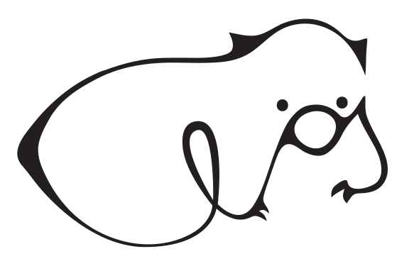

.. elos documentation master file, created by
   sphinx-quickstart on Wed May 10 10:26:00 2023.
   You can adapt this file completely to your liking, but it should at least
   contain the root `toctree` directive.

Welcome to elos's documentation!
================================

|elos_title| [#elos_artwork]_

.. include:: ./doc/elos_paper.rst

.. [#elos_artwork] The elos logo is the Vombatus ursinus, also known as the bare-nosed wombat,
   designed from the handwriting word elos. Originator is Anja Lehwess-Litzmann
   (emlix GmbH). Year 2023. It is licensed under Creative Commons No Derivatives
   (CC-nd). It shall be used in black on white or HKS43 color.

.. toctree::
   :maxdepth: 2
   :caption: Contents:

   Users <doc/userManual>
   Demos <src/demos/index>
   public API <build/Debug/doc/source_generated/api/index>
   Developers <src/index>
   Complete API Reference <build/Debug/doc/source_generated/developer/api/index>
   ADRs <doc/Architecture_Design_Records/index>
   How we document <doc/index>
   Verification Strategy or how we test <test/index>

Indices and tables
==================

* :ref:`genindex`
* :ref:`modindex`
* :ref:`search`

